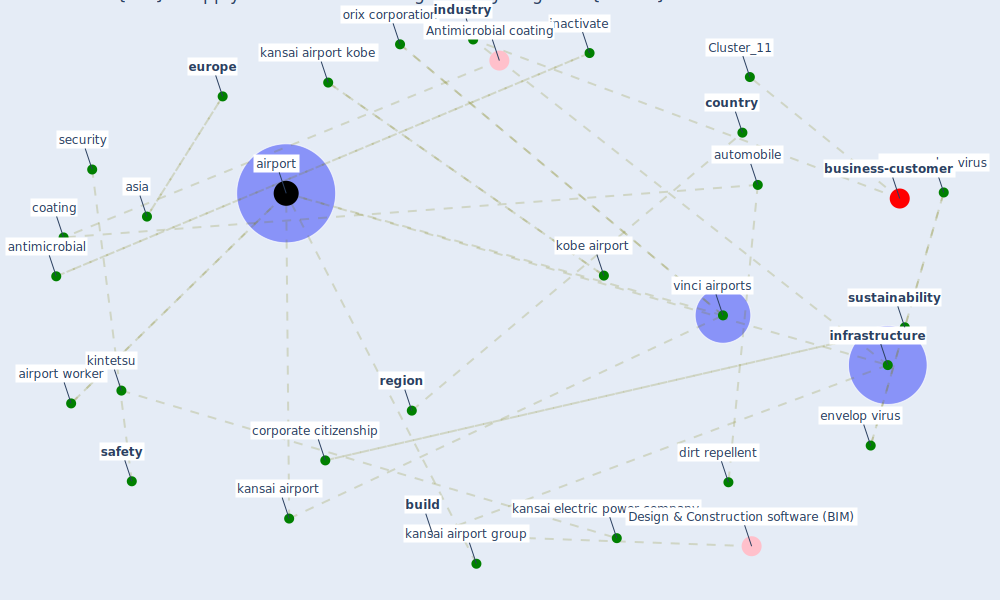

# Article: KIX to apply antimicrobial coating in its fight against COVID-19 (kansai_airport_kix_2021)

* [http://www.kansai-airports.co.jp/en/news/2020/763/E_210326_PressRelease_viruscoat.pdf](http://www.kansai-airports.co.jp/en/news/2020/763/E_210326_PressRelease_viruscoat.pdf)
* Year: 2021
* Cluster: [air-sars](cluster_9)

## Keywords

 * [airport](keyword_airport), airport worker, [antimicrobial](keyword_antimicrobial), asia, automobile, [bacteria](keyword_bacteria), [build](keyword_build), [coating](keyword_coating), [coronavirus](keyword_coronavirus), corporate citizenship, [country](keyword_country), [covid-19](keyword_covid-19), development, dirt repellent, envelop virus, environmental, [europe](keyword_europe), [inactivate](keyword_inactivate), [inactivation](keyword_inactivation), [industry](keyword_industry), [infrastructure](keyword_infrastructure), [japan](keyword_japan), [kansai airport](keyword_kansai_airport), kansai airport group, kansai airport kobe, kansai electric power company, kintetsu, kintetsu group, kobe airport, net zero emission, non envelop virus, orix, orix corporation, region, [safety](keyword_safety), [security](keyword_security), [sustainability](keyword_sustainability), trial, [vinci airports](keyword_vinci_airports), [virus](keyword_virus)

## Concepts

 

## Neighbours

### Closest articles

* Sars-CoV-2 (COVID-19) inactivation capability of copper-coated touch surface fabricated by cold-spray technology - [LINK](article_hutasoit_sars-cov-2_2020)
* A Continuously Active Antimicrobial Coating effective against Human Coronavirus 229E - [LINK](article_ikner_continuously_2020)
* A Surface Coating that Rapidly Inactivates SARS-CoV-2 - [LINK](article_behzadinasab_surface_2020)
* Graphene-based nanomaterials as antimicrobial surface coatings: A parallel approach to restrain the expansion of COVID-19 - [LINK](article_ayub_graphene-based_2021)
* Aerosol and Surface Stability of SARS-CoV-2 as Compared with SARS-CoV-1 - [LINK](article_van_doremalen_aerosol_2020)
* Sustainability of Coronavirus on Different Surfaces - [LINK](article_suman_sustainability_2020)
* Persistence of coronaviruses on inanimate surfaces and their inactivation with biocidal agents - [LINK](article_kampf_persistence_2020)
* The Effect of Opening Windows on Air Change Rates in Two Homes - [LINK](article_howard-reed_effect_2002)
* Characterization and performance evaluation of a full-scale activated carbon-based dynamic botanical air filtration system for improving indoor air quality - [LINK](article_wang_characterization_2011)
* SARS-CoV-2 in wastewater: potential health risk, but also data source - [LINK](article_lodder_sars-cov-2_2020)

### Closest BPs

* Blueprint: Monitoring of wastewater - [LINK](bp_21)
* Blueprint: Installing UV in ductwork - [LINK](bp_10)
* Blueprint: Negative pressure rooms - [LINK](bp_13)
