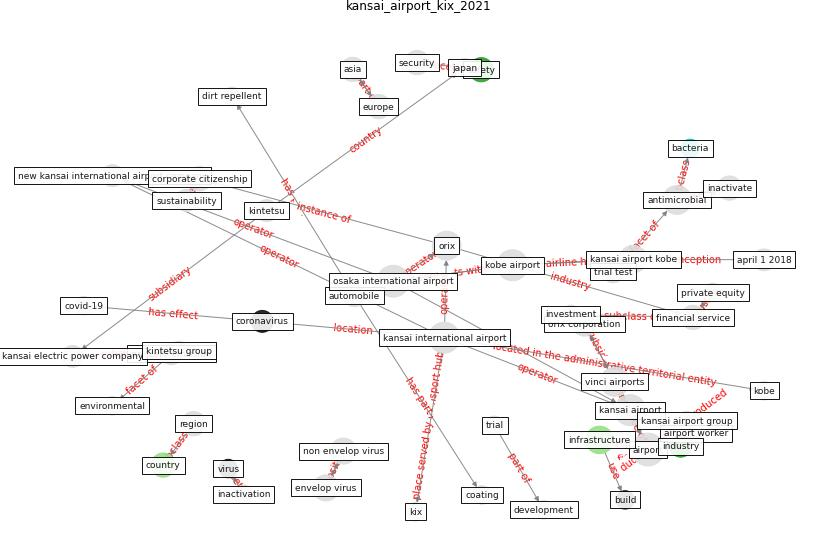

# Article: KIX to apply antimicrobial coating in its fight againstCOVID-19 (kansai_airport_kix_2021)

* [http://www.kansai-airports.co.jp/en/news/2020/763/E_210326_PressRelease_viruscoat.pdf](http://www.kansai-airports.co.jp/en/news/2020/763/E_210326_PressRelease_viruscoat.pdf)
* Year: 2021
* Cluster: [airport-coating](cluster_6)

## Keywords

 * [airport](keyword_airport), airport worker, [antimicrobial](keyword_antimicrobial), asia, automobile, [bacteria](keyword_bacteria), [build](keyword_build), [coating](keyword_coating), [coronavirus](keyword_coronavirus), corporate citizenship, [country](keyword_country), [covid-19](keyword_covid-19), [development](keyword_development), dirt repellent, envelop virus, [environmental](keyword_environmental), [europe](keyword_europe), inactivate, inactivation, [industry](keyword_industry), [infrastructure](keyword_infrastructure), [japan](keyword_japan), [kansai airport](keyword_kansai_airport), kansai airport group, kansai airport kobe, kansai electric power company, kintetsu, kintetsu group, kobe airport, net zero emission, non envelop virus, orix, orix corporation, region, [safety](keyword_safety), [security](keyword_security), [sustainability](keyword_sustainability), trial, [vinci airports](keyword_vinci_airports), [virus](keyword_virus)

## Concepts

 

## Neighbours

### Closest articles

* Graphene-based nanomaterials as antimicrobial surface coatings: A parallel approach to restrain the expansion of COVID-19 - [LINK](article_ayub_graphene-based_2021)
* A Continuously Active Antimicrobial Coating effective against Human Coronavirus 229E - [LINK](article_ikner_continuously_2020)
* Sars-CoV-2 (COVID-19) inactivation capability of copper-coated touch surface fabricated by cold-spray technology - [LINK](article_hutasoit_sars-cov-2_2020)
* A Surface Coating that Rapidly Inactivates SARS-CoV-2 - [LINK](article_behzadinasab_surface_2020)
* Touchless Retail: What the Rest of the World could learn from China’s new ways to shop - [LINK](article_capgemini_touchless_2020)
* Retail Signage During the COVID-19 Pandemic - [LINK](article_mcneish_retail_2020)
* How COVID-19 Could Accelerate the Adoption of New Retail Technologies and Enhance the (E-)Servicescape - [LINK](article_willems_how_2021)
* China adapts survey drones to enforce world’s largest quarantine - [LINK](article_liu_china_2020)

### Closest BPs

* Blueprint: Smart Locker System - [LINK](bp_1)
* Blueprint: Antimicrobial Surfaces - [LINK](bp_5)
* Blueprint: Good hand hygiene practice - [LINK](bp_16)
