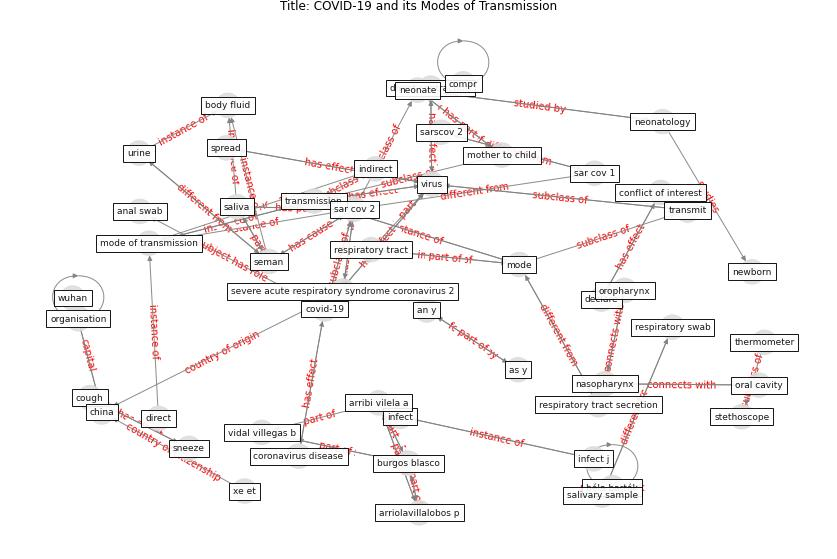

# Article: __COVID-19 and its Modes of Transmission__ (karia_covid-19_2020)

* [10.1007/s42399-020-00498-4](https://doi.org/10.1007/s42399-020-00498-4)
* Cluster: [air-sars](cluster_2)

## Keywords

[transmission](keyword_transmission), [virus](keyword_virus), [aerosol](keyword_aerosol)

## Concepts

 

### References 

* [Air, Surface Environmental, and Personal
Protective Equipment Contamination by Severe
Acute Respiratory Syndrome Coronavirus 2
(SARS-CoV-2) From a Symptomatic Patient](article_ong_air_2020)
* [Aerosol and Surface Stability of SARS-CoV-2 as
Compared with SARS-CoV-1](article_van_doremalen_aerosol_2020)

### Cited by 

