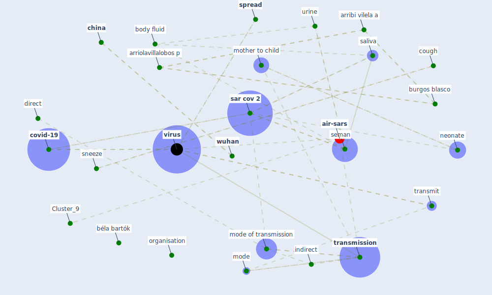

# Article: COVID-19 and its Modes of Transmission (karia_covid-19_2020)

* Source: [10.1007/s42399-020-00498-4](https://doi.org/10.1007/s42399-020-00498-4)
* Year: 2020
* Cluster: [air-sars](cluster_9)

## Keywords

 * SARS-CoV-2, [aerosol](keyword_aerosol), airborne transmission, ama, an y, arribi vilela a, arriolavillalobos p, as y, body fluid, breastfeed, burgos blasco, bushmaker, béla bartók, [california](keyword_california), chen x, [china](keyword_china), community transmission, comorbiditie, compr, [conflict of interest](keyword_conflict_of_interest), conjunctiva, conjunctival, consensus, [coronavirus](keyword_coronavirus), coronavirus 2, coronavirus disease, cough, [covid-19](keyword_covid-19), database, declare, dental, direct, direct contraction, disagreement, epidemiol, et ong, extraction, fixture, fomite, furniture, google scholar, immunol, indirect, infect, infect control, infect dis, infect j, [infection control](keyword_infection_control), [italy](keyword_italy), j ama, [microbiol](keyword_microbiol), [mode](keyword_mode), mode of transmission, morris d, mother, mother to child, nasopharynx, neonate, neonatology, neurosurgery, newborn, ocular, [organisation](keyword_organisation), oropharynx, oxygen, [patient](keyword_patient), preexist disease, protective equipment, protective suit, respiratory secretion, respiratory swab, respiratory tract, respiratory tract secretion, rna, saliva, salivary sample, san francisco, [sar cov 1](keyword_sar_cov_1), [sar cov 2](keyword_sar_cov_2), self hygiene, seman, severe acute respiratory syndrome coronavirus 2, sneeze, [spread](keyword_spread), stethoscope, [study](keyword_study), [surgery](keyword_surgery), thermometer, [transmission](keyword_transmission), transmit, travel med, [unesco](keyword_unesco), urine, [viral](keyword_viral), [virus](keyword_virus), wang j, wang y, [world heritage site](keyword_world_heritage_site), [wuhan](keyword_wuhan), xe et

## Concepts

 

## Neighbours

### Closest articles

* COVID-19 Pandemic: Prevention and Protection Measures to Be Adopted at the Workplace - [LINK](article_cirrincione_covid-19_2020)
* Current knowledge of COVID-19: Advances, challenges and future perspectives - [LINK](article_wu_current_2021)
* COVID-19: Risk assessment and mitigation measures in healthcare and non-healthcare workplaces - [LINK](article_fawzy_covid-19_2021)
* Physical interventions to interrupt or reduce the spread of respiratory viruses: systematic review - [LINK](article_jefferson_physical_2008)
* COVID-19 Prevention and Control Measures in Workplace Settings: A Rapid Review and Meta-Analysis - [LINK](article_ingram_covid-19_2021)
* SARS-CoV-2 RNA detection of hospital isolation wards hygiene monitoring during the Coronavirus Disease 2019 outbreak in a Chinese hospital - [LINK](article_wang_sars-cov-2_2020)
* Sustainability of Coronavirus on Different Surfaces - [LINK](article_suman_sustainability_2020)
* Air, Surface Environmental, and Personal Protective Equipment Contamination by Severe Acute Respiratory Syndrome Coronavirus 2 (SARS-CoV-2) From a Symptomatic Patient - [LINK](article_ong_air_2020)
* Aerosol and Surface Stability of SARS-CoV-2 as Compared with SARS-CoV-1 - [LINK](article_van_doremalen_aerosol_2020)
* Aerosol and Surface Distribution of Severe Acute Respiratory Syndrome Coronavirus 2 in Hospital Wards, Wuhan, China, 2020 - [LINK](article_guo_aerosol_2020)

### Closest BPs

* Blueprint: Negative pressure rooms - [LINK](bp_13)
* Blueprint: Installing high-efficiency air filters - [LINK](bp_11)
* Blueprint: Installing UV in ductwork - [LINK](bp_10)
