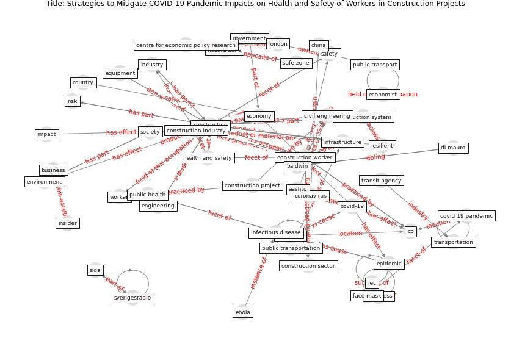

# Article: Strategies to Mitigate COVID-19 Pandemic Impacts on Health and Safety of Workers in Construction Projects (kaushal_strategies_2021)

* Source: [10.36937/cebel.2021.002.001](https://doi.org/10.36937/cebel.2021.002.001)
* Year: 2021
* Cluster: [construction-resilience](cluster_5)

## Keywords

 * a davis, aashto, adversity, baldwin, [business](keyword_business), catalyst, centre for economic policy research, [china](keyword_china), civil engineering, [construction](keyword_construction), [construction industry](keyword_construction_industry), construction project, construction sector, construction system, [construction worker](keyword_construction_worker), [coronavirus](keyword_coronavirus), [country](keyword_country), [covid 19 pandemic](keyword_covid_19_pandemic), [covid-19](keyword_covid-19), cp, database, [development](keyword_development), di mauro, disease pandemic, dot, e commerce, earthquake, ebola, economic outlook, economist, [economy](keyword_economy), [education](keyword_education), employment, end user, [engineering](keyword_engineering), [environment](keyword_environment), [environmental](keyword_environmental), [epidemic](keyword_epidemic), equipment, face mask, first covid 19 case, gold price chart, [government](keyword_government), hazard zone, [health](keyword_health), [health and safety](keyword_health_and_safety), [impact](keyword_impact), [industry](keyword_industry), inequality, [infectious disease](keyword_infectious_disease), [infrastructure](keyword_infrastructure), insider, interview, lachapelle, [logistic](keyword_logistic), [london](keyword_london), maintenance, manage, mediterranean basin, middle east, mitigate, najafi, negative, [new york](keyword_new_york), new york city metropolitan transportation authority, nineteen eighty four, [oecd](keyword_oecd), [operation](keyword_operation), ozone, [pandemic](keyword_pandemic), positive, prevention, [public](keyword_public), [public health](keyword_public_health), public health and safety guideline, [public transport](keyword_public_transport), public transportation, readiness, rec, [resilience](keyword_resilience), resilient, [risk](keyword_risk), safe zone, [safety](keyword_safety), sida, [society](keyword_society), [state](keyword_state), stay at home, survey, [sustainable](keyword_sustainable), sverigesradio, toll, transit agency, transportation, [virus](keyword_virus), voxeu, voxeu org, [washington dc](keyword_washington_dc), work fromhome, [worker](keyword_worker)

## Concepts

 

## Neighbours

### Closest articles

* Analysis of COVID-19 Concerns Raised by the Construction Workforce and Development of Mitigation Practices - [LINK](article_bou_hatoum_analysis_2021)
* Covid-19 Associated Risks and Mitigation Strategies relevant for the UK Construction Industry - [LINK](article_dan-jumbo_covid-19_2021)
* Impacts of COVID-19 on Health and Safety of Workforce in Construction Industry - [LINK](article_pamidimukkala_impacts_2021)
* Guidelines for Responding to COVID-19 Pandemic: Best Practices, Impacts, and Future Research Directions - [LINK](article_assaad_guidelines_2021)
* COVID-19 pandemic: the effects and prospects in the construction industry. - [LINK](article_ogunnusi_covid-19_2020)
* Identifying Actions to Control and Mitigate the Effects of the COVID-19 Pandemic on Construction Organizations: Preliminary Findings - [LINK](article_raoufi_identifying_2021)
* Propositions for a Resilient, Post-COVID-19 Future for the AEC Industry - [LINK](article_nassereddine_propositions_2021)
* Influence between COVID-19 Impacts and Project Stakeholders in Chilean Construction Projects - [LINK](article_araya_influence_2021)
* Mechanisms for addressing the impact of COVID-19 on infrastructure projects - [LINK](article_king_mechanisms_2021)
* The Impact of Pandemic Crisis on the Survival of Construction Industry: A Case of COVID-19 - [LINK](article_gamil_impact_2020)

### Closest BPs

* Blueprint: Mental health – Commit: Do something meaningfull - [LINK](bp_20)
* Blueprint: Mental health – Belong: Do something with someone - [LINK](bp_19)
* Blueprint: Mental health – Act: Do something - [LINK](bp_18)
