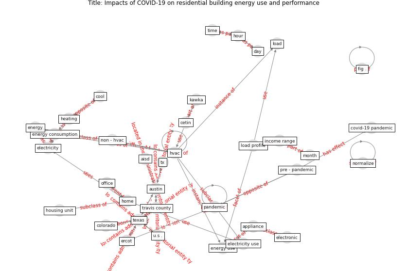

# Article: Impacts of COVID-19 on residential building energy use and performance (kawka_impacts_2021)

* Source: [10.1016/j.buildenv.2021.108200](https://doi.org/10.1016/j.buildenv.2021.108200)
* Year: 2021
* Cluster: [building-space](cluster_1)

## Keywords

 * 11 a m, 12 p m, 2008 summer olympic, adl, analysis, ansi, appliance, archive, [ashrae](keyword_ashrae), assoc, [austin](keyword_austin), austin independent school district, [beijing](keyword_beijing), [build](keyword_build), [california](keyword_california), california energy commission, civilian unemployment rate, commute, compete interest, cool, [covid 19 pandemic](keyword_covid_19_pandemic), [covid-19](keyword_covid-19), [datum](keyword_datum), datum analysis, datum quality control, day, declaration of compete interest, effect of the coronavirus covid 19 pandemic, eia, electricity, electricity demand, electricity usage, electronic, en ergy, [energy](keyword_energy), energy audit, [energy consumption](keyword_energy_consumption), [energy use](keyword_energy_use), ercot, fit, furnace, gas, h do, heating, heating unit, high income, [home](keyword_home), home energy monitoring system, hour, hourly, hourly frequency, [household](keyword_household), household income, household survey, [housing](keyword_housing), housing unit, [hvac](keyword_hvac), hvac load, hvac system, in come, in person, in person learn, income range, ipv4, k s cetin, [lighting](keyword_lighting), load, load profile, low household income group, low income, low income group, median hourly load, [month](keyword_month), non hvac, normalize, [pandemic](keyword_pandemic), percent change, piously, pre pandemic period, pre-pandemic, remote learning, [research](keyword_research), [residential](keyword_residential), restaurant, [school](keyword_school), section, significantly impact when and how electricity be consume, [social medium](keyword_social_medium), [temperature](keyword_temperature), [texas](keyword_texas), time of day, travis county, traviscounty, u s, unit, [united states](keyword_united_states), usage, weather, year, چچ

## Concepts

 

## Neighbours

### Closest articles

* Occupants’ behavior and activity patterns influencing the energy consumption in the Kuwaiti residences - [LINK](article_al-mumin_occupants_2003)
* Addressing the impact of COVID-19 lockdown on energy use in municipal buildings: A case study in Florianópolis, Brazil - [LINK](article_geraldi_addressing_2021)
* The effect of occupant distribution on energy consumption and COVID-19 infection in buildings: A case study of university building - [LINK](article_mokhtari_effect_2021)
* Validity of energy social research during and after COVID-19: challenges, considerations, and responses - [LINK](article_fell_validity_2020)
* Reflecting on Impacts of COVID19 on Sustainable Buildings and Cities - [LINK](article_gonzalez_reflecting_2021)
* Assessment of Building Automation and Control Systems in Danish Healthcare Facilities in the COVID-19 Era - [LINK](article_pedersen_assessment_2022)
* Contextualizing the Covid-19 pandemic for a carbon-constrained world: Insights for sustainability transitions, energy justice, and research methodology - [LINK](article_sovacool_contextualizing_2020)
* Covid-19 and the politics of sustainable energy transitions - [LINK](article_kuzemko_covid-19_2020)
* The Effect of Opening Windows on Air Change Rates in Two Homes - [LINK](article_howard-reed_effect_2002)
* Characterization and performance evaluation of a full-scale activated carbon-based dynamic botanical air filtration system for improving indoor air quality - [LINK](article_wang_characterization_2011)

### Closest BPs

* Blueprint: Negative pressure rooms - [LINK](bp_13)
* Blueprint: Air Cleaning Plants - [LINK](bp_15)
* Blueprint: Public places as information points - [LINK](bp_8)
