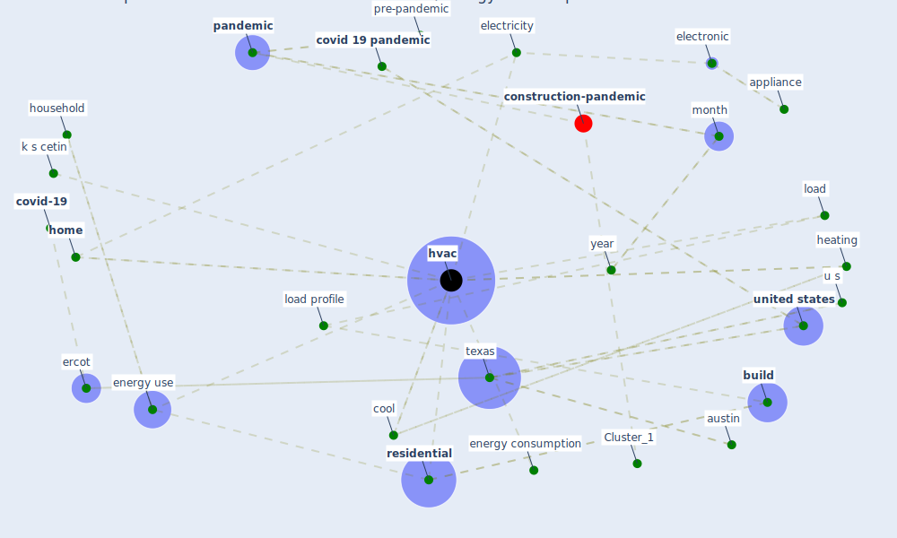

# Article: Impacts of COVID-19 on residential building energy use and performance (kawka_impacts_2021)

* Source: [10.1016/j.buildenv.2021.108200](https://doi.org/10.1016/j.buildenv.2021.108200)
* Year: 2021
* Cluster: [construction-pandemic](cluster_1)

## Keywords

 * 11 a m, 12 p m, 2008 summer olympic, adl, [analysis](keyword_analysis), ansi, appliance, archive, [ashrae](keyword_ashrae), assoc, [austin](keyword_austin), austin independent school district, [beijing](keyword_beijing), [build](keyword_build), [california](keyword_california), california energy commission, civilian unemployment rate, cool, [covid 19 pandemic](keyword_covid_19_pandemic), [covid-19](keyword_covid-19), [datum](keyword_datum), datum analysis, datum quality control, day, declaration of compete interest, effect of the coronavirus covid 19 pandemic, electricity, electricity usage, electronic, en ergy, [energy](keyword_energy), energy audit, [energy consumption](keyword_energy_consumption), energy use, ercot, fit, furnace, gas, h do, heating, heating unit, high income, [home](keyword_home), home energy monitoring system, hour, hourly, hourly frequency, [household](keyword_household), household income, household survey, [housing](keyword_housing), housing unit, [hvac](keyword_hvac), hvac load, [hvac system](keyword_hvac_system), income range, ipv4, k s cetin, lighting, load, load profile, low household income group, low income, low income group, measure datum, median hourly load, michigan state university, middle, [model](keyword_model), [month](keyword_month), news gov, non hvac, normalize, [pandemic](keyword_pandemic), percent change, piously, pre pandemic period, pre-pandemic, remote learning, remotely, [research](keyword_research), [residential](keyword_residential), restaurant, [school](keyword_school), section, significantly impact when and how electricity be consume, sustain, [temperature](keyword_temperature), [texas](keyword_texas), time of day, travis county, traviscounty, u s, unemployed, unit, [united states](keyword_united_states), usage, weather, weather normalize, [year](keyword_year)

## Concepts

 

## Neighbours

### Closest articles

* Occupants’ behavior and activity patterns influencing the energy consumption in the Kuwaiti residences - [LINK](article_al-mumin_occupants_2003)
* Addressing the impact of COVID-19 lockdown on energy use in municipal buildings: A case study in Florianópolis, Brazil - [LINK](article_geraldi_addressing_2021)
* The effect of occupant distribution on energy consumption and COVID-19 infection in buildings: A case study of university building - [LINK](article_mokhtari_effect_2021)
* Reflecting on Impacts of COVID19 on Sustainable Buildings and Cities - [LINK](article_gonzalez_reflecting_2021)
* Assessment of Building Automation and Control Systems in Danish Healthcare Facilities in the COVID-19 Era - [LINK](article_pedersen_assessment_2022)
* Validity of energy social research during and after COVID-19: challenges, considerations, and responses - [LINK](article_fell_validity_2020)
* Contextualizing the Covid-19 pandemic for a carbon-constrained world: Insights for sustainability transitions, energy justice, and research methodology - [LINK](article_sovacool_contextualizing_2020)
* Covid-19 and the politics of sustainable energy transitions - [LINK](article_kuzemko_covid-19_2020)
* Ten questions concerning occupant health in buildings during normal operations and extreme events including the COVID-19 pandemic - [LINK](article_awada_ten_2021)
* Designing Post COVID-19 Buildings: Approaches for Achieving Healthy Buildings - [LINK](article_navaratnam_designing_2022)

### Closest BPs

* Blueprint: nan - [LINK](bp_34)
* Blueprint: Tender support at building stage - [LINK](bp_9)
* Blueprint: Building Adaptation during a pandemic - [LINK](bp_14)
