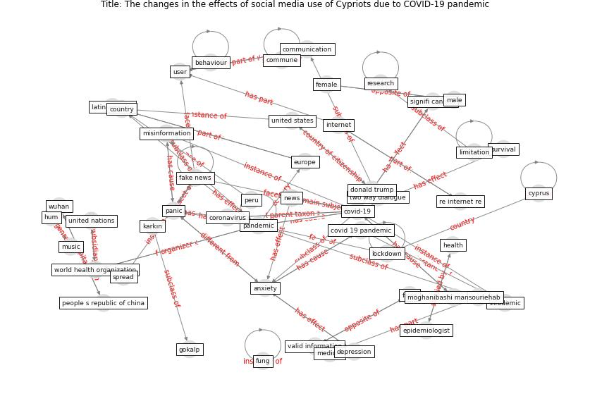

# Article: The changes in the effects of social media use of Cypriots due to COVID-19 pandemic (kaya_changes_2020)

* Source: [10.1016/j.techsoc.2020.101380](https://doi.org/10.1016/j.techsoc.2020.101380)
* Year: 2020
* Cluster: [city-health](cluster_14)

## Keywords

 * [age group](keyword_age_group), [anxiety](keyword_anxiety), awareness, behaviour, commune, communication, corona phobia, [coronavirus](keyword_coronavirus), [country](keyword_country), [covid 19 pandemic](keyword_covid_19_pandemic), [covid-19](keyword_covid-19), [crisis](keyword_crisis), cronbach s alpha, cyberpsychology, cyprus, [depression](keyword_depression), digital medium, donald trump, drug, [economic](keyword_economic), epidemiologist, [europe](keyword_europe), [facebook](keyword_facebook), [fake news](keyword_fake_news), false, fatality, female, fiscal issue, fung, furthermore avery, gautam, giuseppe verdi, gokalp, [health](keyword_health), health inf, hsu, huang, hum, humboldt, humboldt university, hygiene, infodemic, [information](keyword_information), information retrieval, information technology, [internet](keyword_internet), isolate themselves, karkın, knowledge sharing, latin america, likert scale, [limitation](keyword_limitation), lin, literature review, [lockdown](keyword_lockdown), male, medium, metoo movement, ministry of health, [misinformation](keyword_misinformation), moghanibashi mansouriehab, murad, music, [news](keyword_news), normal, official organization, [pandemic](keyword_pandemic), panic, partici pat, people s republic of china, [peru](keyword_peru), pharmacist, public information officer, questionnaire, re internet re, [research](keyword_research), self awareness, [social medium](keyword_social_medium), social medium use, social medium user, social network, social site, social status, [society](keyword_society), song, source, [spread](keyword_spread), survival, technology in society, thailand, [twitter](keyword_twitter), two way dialogue, unicef, [united nations](keyword_united_nations), [united states](keyword_united_states), [user](keyword_user), valid information, [world health organization](keyword_world_health_organization), [wuhan](keyword_wuhan), youtube

## Concepts

 

## Neighbours

### Closest articles

* What drives unverified information sharing and cyberchondria during the COVID-19 pandemic? - [LINK](article_laato_what_2020)
* COVID-19 misinformation: Accuracy of articles about coronavirus prevention mostly shared on social media - [LINK](article_obiala_covid-19_2021)
* COVID-19 media fatigue: predictors of decreasing interest and avoidance of COVID-19–related news - [LINK](article_buneviciene_covid-19_2021)
* Infodemic and the spread of fake news in the COVID-19-era - [LINK](article_orso_infodemic_2020)
* Coronavirus: Can artificial intelligence be smart enough to detect fake news? - [LINK](article_tong_coronavirus_2020)
* Climate and the spread of COVID-19 - [LINK](article_chen_climate_2021)
* COVID-19 could be a seasonal illness with higher risk in winter: Reduced humidity linked to increased COVID-19 risk - [LINK](article_university_of_sydney_covid-19_2020)
* The impacts of knowledge, risk perception, emotion and information on citizens’ protective behaviors during the outbreak of COVID-19: a cross-sectional study in China - [LINK](article_ning_impacts_2020)
* Social distancing enhanced automated optimal design of physical spaces in the wake of the COVID-19 pandemic - [LINK](article_ugail_social_2021)
* Knowledge, attitudes, and practices of Indonesian residents regarding COVID-19: A national cross-sectional survey - [LINK](article_yodang_knowledge_2021)

### Closest BPs

* Blueprint: Negative pressure rooms - [LINK](bp_13)
* Blueprint: Public places as information points - [LINK](bp_8)
* Blueprint: Resilience in staffing and skills training - [LINK](bp_12)
