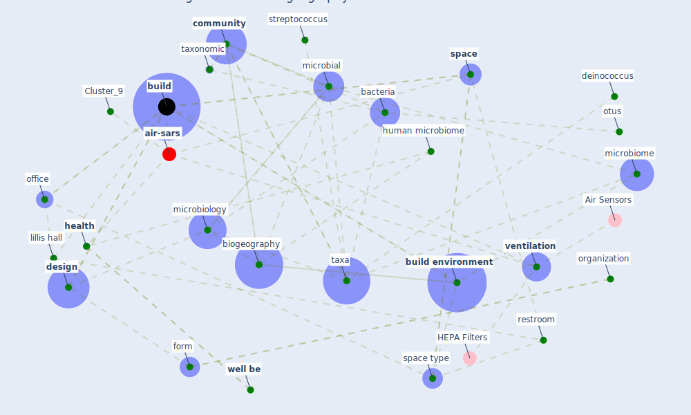

# Article: Architectural Design Drives the Biogeography of Indoor Bacterial Communities (kembel_architectural_2014)

* Source: [10.1371/journal.pone.0087093](https://doi.org/10.1371/journal.pone.0087093)
* Year: 2014
* Cluster: [air-sars](cluster_9)

## Keywords

 * 72uc, adhikari a, [airborne](keyword_airborne), allergy, [architecture](keyword_architecture), [bacteria](keyword_bacteria), bacterial, barcode, betweenness, [biogeography](keyword_biogeography), bohannan bjm, brown jh, [build](keyword_build), build dust, [build environment](keyword_build_environment), canberra, canberra distance, caporaso jg, classroom, [community](keyword_community), connectance distance, degree, deinococcus, [design](keyword_design), [distance](keyword_distance), dna extraction, dust, ecology, [ecosystem](keyword_ecosystem), end, [engineering](keyword_engineering), firmicute, form, function, fungi, [gene](keyword_gene), [health](keyword_health), [human health](keyword_human_health), human microbiome, illumina, klepeis ne, knight d, koskinen k, kuczynski j, lactobacillus, larsen n, lauber cl, legendre p, lillis hall, low human diversity, lung function, macroorganism, mantel test, martuzevicius d, maximum, methylobacterium, metric, mhuireach g, microbe, [microbial](keyword_microbial), microbiological, microbiology, microbiome, [microorganism](keyword_microorganism), minimum, nelson wc, [network](keyword_network), network centrality, o connor tk, o hara b, [office](keyword_office), order level, ordination axi, organization, otus, package, pcr1, permanova, proteobacteria, qiime, radioduran, relative humidity, restroom, robinson cj, rojas m, sequence, [space](keyword_space), space type, staphylococcus, streptococcus, [taxa](keyword_taxa), taxonomic, taxonomic group, taxonomic level, vegan, [ventilation](keyword_ventilation), ventilation source, [well be](keyword_well_be), window ventilate, window ventilate faculty office

## Concepts

 

## Neighbours

### Closest articles

* COVID-19 Lessons for a Resilient Built Environment: A Roadmap - [LINK](article_hull_covid-19_2020)
* The COVID-19 Impact on Flexible Office Space - [LINK](article_clifton_covid-19_2020)
* Adaptive Design of the Built Environment to Mitigate the Transmission Risk of COVID-19 - [LINK](article_ara_dilshad_shangi_adaptive_2020)
* Biophilic design in architecture and its contributions to health, well-being, and sustainability: A critical review - [LINK](article_zhong_biophilic_2022)
* How Architecture Fails in Conditions of Crisis: a Discussion on the Value of Interior Design over the COVID-19 Outbreak - [LINK](article_rassia_how_2020)
* The contribution of green buildings in the fight against COVID-19 - [LINK](article_world_green_building_council_contribution_2020)
* It’s time to reimagine where and how work will get done (PwC’s US Remote Work Survey) - [LINK](article_pricewaterhousecoopers_its_2021)
* Designing for COVID-2x: Reflecting on Future-Proofing Human Habitation for the Inevitable Next Pandemic - [LINK](article_spennemann_designing_2022)
* RESIDENTIAL ARCHITECTURE IN A POST-PANDEMIC WORLD: IMPLICATIONS OF COVID-19 FOR NEW CONSTRUCTION AND FOR ADAPTING HERITAGE BUILDINGS - [LINK](article_spennemann_residential_2021)
* How the Coronavirus Will Reshape Architecture - [LINK](article_chayka_how_2020)

### Closest BPs

* Blueprint: Tracking and enforcing use of Personal Protective Equipment - [LINK](bp_23)
* Blueprint: Building Adaptation during a pandemic - [LINK](bp_14)
* Blueprint: Architecture design - [LINK](bp_2)
