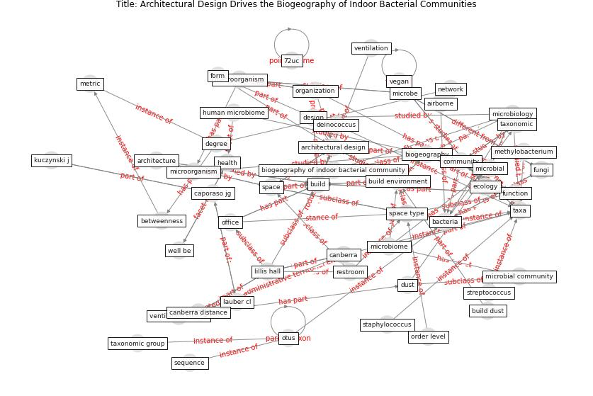

# Article: __Architectural Design Drives the Biogeography of Indoor Bacterial Communities__ (kembel_architectural_2014)

* [10.1371/journal.pone.0087093](https://doi.org/10.1371/journal.pone.0087093)
* Cluster: [building-health](cluster_10)

## Keywords

[build](keyword_build), [space](keyword_space), [bacteria](keyword_bacteria), [office](keyword_office), [health](keyword_health), [ventilation](keyword_ventilation)

## Concepts

 

