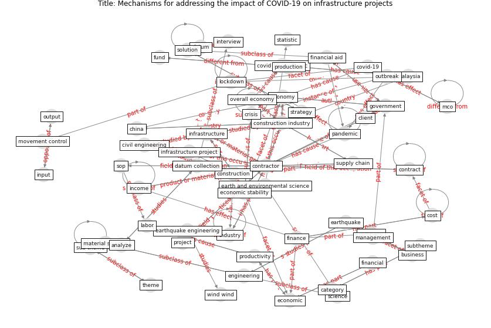

# Article: __Mechanisms for addressing the impact of COVID-19 on infrastructure projects__ (king_mechanisms_2021)

* [10.1088/1755-1315/682/1/012047](https://doi.org/10.1088/1755-1315/682/1/012047)
* Cluster: [construction-project](cluster_9)

## Keywords

[contractor](keyword_contractor), [construction](keyword_construction), [engineering](keyword_engineering), [industry](keyword_industry), [pandemic](keyword_pandemic)

## Abstract

Abstract The COVID-19 pandemic has affected the overall
economy and the construction industry badly. The Movement
Control Order (MCO) caused the suspension of the
construction sector, including infrastructure projects.
Contractors are suffering losses and facing many problems
caused by the pandemic, even with the on-going government
financial aids. By identifying the right approaches to
improve existing government policies and strategies,
contractors could better manage the problems. Thus, this
research aims to explore mechanisms for reducing
COVID-19’s negative impact on the infrastructure
construction industry. To achieve that objective, this
study involves collecting and analyzing interview data with
industry practitioners. The significant findings from the
analysis are: (1) COVID-19 affects the infrastructure
construction industry by causing financial and productivity
problems; and (2) mechanisms to address those problems
include legal, financial, productivity, and environmental
support. This paper’s finding is valuable for the
government in determining the right actions in assisting
contractors in this critical period.

## Concepts

 

### References 

* [The Impact of Pandemic Crisis on the Survival of
Construction Industry: A Case of COVID-19](article_gamil_impact_2020)

### Cited by 

* [Influence between COVID-19 Impacts and Project
Stakeholders in Chilean Construction Projects](article_araya_influence_2021)* [Analysis of COVID-19 Concerns Raised by the
Construction Workforce and Development of
Mitigation Practices](article_bou_hatoum_analysis_2021)
