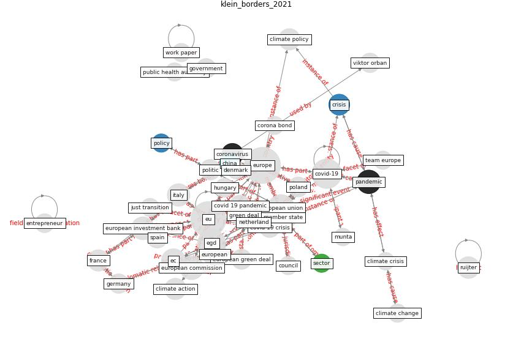

# Article: __Borders and Catastrophe: lessons from COVID-19 for the European Green Deal__ (klein_borders_2021)

* [10.30722/anzjes.vol12.iss2.15071](https://doi.org/10.30722/anzjes.vol12.iss2.15071)
* Cluster: [health-building](cluster_9)

## Keywords

* [europe](keyword_europe), [covid-19](keyword_covid-19), [egd](keyword_egd), [member state](keyword_member_state), [european union](keyword_european_union), [european](keyword_european), [ec](keyword_ec), [pandemic](keyword_pandemic), [green deal](keyword_green_deal), [european commission](keyword_european_commission), european investment bank, [italy](keyword_italy), climate action, france, climate policy

## Keywords at large

* [europe](keyword_europe), [covid-19](keyword_covid-19), [egd](keyword_egd), [member state](keyword_member_state), [european union](keyword_european_union), [european](keyword_european), [ec](keyword_ec), [pandemic](keyword_pandemic), [green deal](keyword_green_deal), [european commission](keyword_european_commission)

## Abstract

This article considers how the European Union and Member
States’ responses to the COVID-19 crisis in the first
half of 2020 could inform climate action in Europe, and
particularly the resumption of actions on the EGD. It first
outlines the EU’s public health and economic responses to
COVID-19 and Europe’s role in the global response to the
pandemic. We find that, based on the challenges and
successes of all these responses, a strong argument can be
made for ‘more Europe’ – greater integration, and
stronger EU-level institutions – to lead and govern the
COVID-19 response. This has direct lessons for the
governance and scope of future climate action.

## Concepts

 

### Closest articles 

* [How drones help cities during the Covid-19 pandemic
\textbar TheMayor.EU](article_dimitrova_how_2021)
* [2020 Data Protection Report](article_council_of_europe_2020_2020)
* [Challenges of data sharing in European Covid-19 projects: A learning opportunity for advancing pandemic preparedness and response](article_tacconelli_challenges_2022)
* [Recently employed engineering techniques to reduce the spread of COVID-19 (corona virus disease 2019): a review study](article_saman_recently_2021)
* [World Bank Development Report](article_world_bank_world_2022)
* [COVID-19 and regional solutions for mitigating the risk of SME finance in selected ASEAN member states](article_taghizadeh-hesary_covid-19_2022)
* [Combating COVID-19—The role of robotics in managing public health and infectious diseases](article_yang_combating_2020)
* [Danish disinfection robots save lives in the fight against
the Corona virus \textbar Shaping Europe’s
digital future](article_ec_views_danish_2020)
* [A Comprehensive Review of the COVID-19 Pandemic and the Role of IoT, Drones, AI, Blockchain, and 5G in Managing its Impact](article_chamola_comprehensive_2020)
* [Drones. Disinfecting robots. Supercomputers. The
coronavirus outbreak is a test for China's tech industry
\textbar CNN Business](article_wang_drones_2020)

