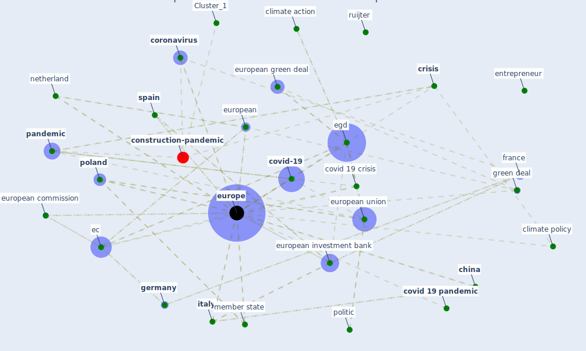

# Article: Borders and Catastrophe: lessons from COVID-19 for the European Green Deal (klein_borders_2021)

* Source: [10.30722/anzjes.vol12.iss2.15071](https://doi.org/10.30722/anzjes.vol12.iss2.15071)
* Year: 2021
* Cluster: [health-city](cluster_1)

## Keywords

 * 15 klein, 36 billion, [austria](keyword_austria), bismarck, border tax, burgoon, bénassy quéré, carbon border tax, [china](keyword_china), climate action, [climate change](keyword_climate_change), climate crisis, climate policy, corona bond, [coronavirus](keyword_coronavirus), council, [covid 19 crisis](keyword_covid_19_crisis), covid 19 outbreak, [covid 19 pandemic](keyword_covid_19_pandemic), [covid-19](keyword_covid-19), [crisis](keyword_crisis), czech, democracy, [denmark](keyword_denmark), ec, ec s, ecb, [ecosystem](keyword_ecosystem), [egd](keyword_egd), [entrepreneur](keyword_entrepreneur), epirus, equity, esm, eu level institution, euractiv, [europe](keyword_europe), europe in the time of covid 19, european, european commission, european council, european emission trading system, european green deal, european investment bank, european solidarity, [european union](keyword_european_union), eurozone crisis, eurozone crisis of 2010 2012, fidesz, fran timmerman, [france](keyword_france), g7, [germany](keyword_germany), governance, [government](keyword_government), green deal, green growth, health crisis, helsinki committee, henry iv, human right, hungarian civil liberty union, hungarian helsinki committee, hungarian parliament, hungary, [infection](keyword_infection), institute, interim measure, [italy](keyword_italy), just transition, [mask](keyword_mask), [member state](keyword_member_state), [netherland](keyword_netherland), [news](keyword_news), [pandemic](keyword_pandemic), [poland](keyword_poland), policy frame, politic, politico eu, press, procurement, public health authority, renewable energy economy, [route](keyword_route), ruijter, [sector](keyword_sector), solidarity, [spain](keyword_spain), state aid, [supply chain management](keyword_supply_chain_management), [sustainable development goal](keyword_sustainable_development_goal), team europe, thunberg, [united nations](keyword_united_nations), vandenbroucke, [ventilator](keyword_ventilator), viktor orbán, visegrad, [ward](keyword_ward), william iv, work paper

## Concepts

 

## Neighbours

### Closest articles

* World Bank Development Report - [LINK](article_world_bank_world_2022)
* COVID-19 and regional solutions for mitigating the risk of SME finance in selected ASEAN member states - [LINK](article_taghizadeh-hesary_covid-19_2022)
* DfMA for rapid adaptive resilience and flexible infrastructure - [LINK](article_mott_macdonald_dfma_2020)
* <scp>COVID</scp>             ‐19: Small and medium enterprises challenges and responses with creativity, innovation, and entrepreneurship - [LINK](article_thukral_covid19_2021)
* Navigating Climate Change: Rethinking the Role of Buildings - [LINK](article_cole_navigating_2020)
* COVID-19 risks and systemic gaps in Nigeria: resilience building lessons for pandemic and climate change management - [LINK](article_lawal_covid-19_2022)
* Startups in times of crisis – A rapid response to the COVID-19 pandemic - [LINK](article_kuckertz_startups_2020)
* Covid-19 and asset management in EU: a preliminary assessment of performance and investment styles - [LINK](article_rizvi_covid-19_2020)
* Building sustainable finance for resilient protected and conserved areas: lessons from COVID-19 - [LINK](article_cumming_building_2021)
* What our response to the COVID-19 pandemic tells us of our capacity to respond to climate change - [LINK](article_gemenne_what_2020)

### Closest BPs

* Blueprint: Smart Locker System - [LINK](bp_1)
* Blueprint: Resilience in staffing and skills training - [LINK](bp_12)
* Blueprint: Rotational Shift System - [LINK](bp_0)
