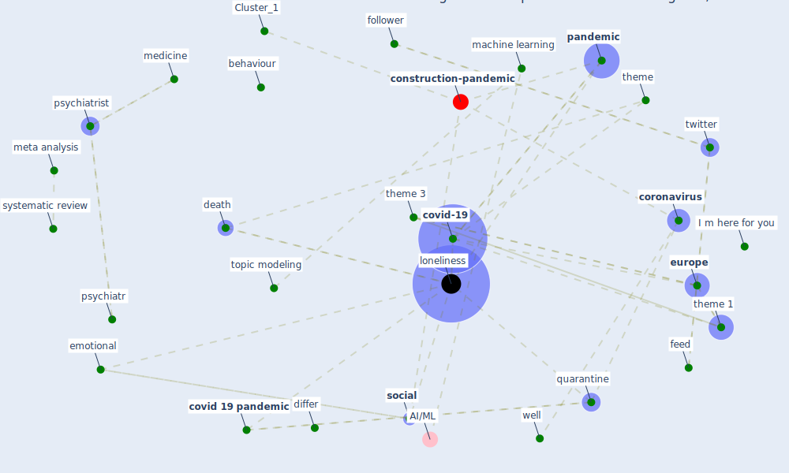

# Article: How loneliness is talked about in social media during COVID-19 pandemic: Text mining of 4,492 Twitter feeds (koh_how_2022)

* Source: [10.1016/j.jpsychires.2020.11.015](https://doi.org/10.1016/j.jpsychires.2020.11.015)
* Year: 2022
* Cluster: [construction-pandemic](cluster_1)

## Keywords

 * 7 7 e1000316, I m here for you, [algorithm](keyword_algorithm), america, [analysis](keyword_analysis), [anxiety](keyword_anxiety), asia, bagel, bedsit, behaviour, britain, can see thank lot hope, [canada](keyword_canada), cardiovascular risk factor, castaldelli maia, [china](keyword_china), continent, cope strategy, [coronavirus](keyword_coronavirus), [covid 19 pandemic](keyword_covid_19_pandemic), covid 19 relate loneliness, [covid-19](keyword_covid-19), [datum](keyword_datum), death, declaration of compete interest, differ, e1000316, emotion, emotional, english, ephltm, [europe](keyword_europe), family, feed, follower, free text, friend, good, h g well, [india](keyword_india), inflammatory, isolation, judgement, koh, list of word, ljubljana, [lockdown](keyword_lockdown), lone liness, [loneliness](keyword_loneliness), lonely, machine learning, manuscript, mechanism, medicine, ment, [meta analysis](keyword_meta_analysis), non pandemic season, nus edu sg, origin, [pandemic](keyword_pandemic), [perspective](keyword_perspective), psychiatr, [psychiatrist](keyword_psychiatrist), psychogeriatr, quarantine, real, recent study, reddit, reject, [research](keyword_research), research implication, risk factor, root, sentence, [social](keyword_social), socialisolation, stop word, supervised machine learning, [survey](keyword_survey), [switzerland](keyword_switzerland), systematic review, the grape of wrath, thematic analysis, [theme](keyword_theme), theme 1, theme 2, theme 3, theory, topic model, topic modeling, [toronto](keyword_toronto), [twitter](keyword_twitter), ucla loneliness scale, user, [virus](keyword_virus), well, wethington, word, word cloud, [wuhan](keyword_wuhan)

## Concepts

 

## Neighbours

### Closest articles

* How Covid-19 Has Permanently Changed the Fitness Industry - [LINK](article_davalos_how_2021)
* A Platform for Citizen Cooperation during the COVID-19 Pandemic in RN, Brazil - [LINK](article_de_araujo_platform_2020)
* Multilevel Analysis of Personal, Non-Medical COVID-19-Related Impact Worldwide - [LINK](article_dye_multilevel_2020)
* Rotating groups at work, school best against COVID-19 spread: Study - [LINK](article_afp_rotating_2021)
* Reframe how to serve your community in the midst of a pandemic - [LINK](article_sutton_reframe_2020)
* Assessing the health and hygiene performance of apartment buildings - [LINK](article_ho_assessing_2004)
* Construction of a Linked Data Set of COVID-19 Knowledge Graphs: Development and Applications - [LINK](article_wang_construction_2022)
* COVID-19 Bulletin 1: Alterations to BREEAM assessment requirements as a result of the Coronavirus pandemic – Knowledge Base - [LINK](article_breeam_covid-19_2020)
* Mental health economics: A prospective study on psychological flourishing and associations with healthcare costs and sickness benefit transfers in Denmark - [LINK](article_santini_mental_2021)

### Closest BPs

* Blueprint: Resilience in staffing and skills training - [LINK](bp_12)
* Blueprint: Tracking and enforcing use of Personal Protective Equipment - [LINK](bp_23)
* Blueprint: Public places as information points - [LINK](bp_8)
