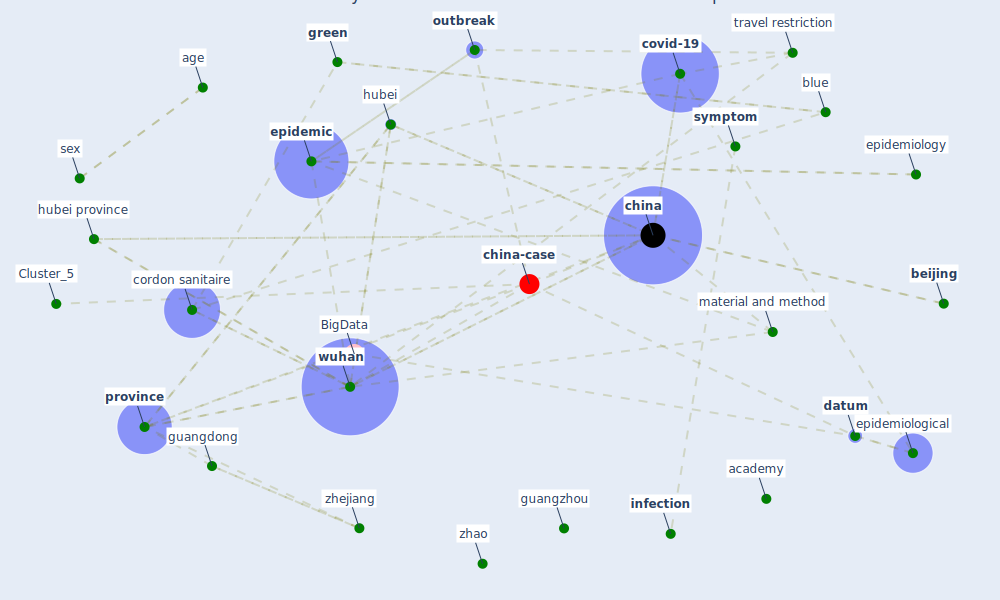

# Article: The effect of human mobility and control measures on the COVID-19 epidemic in China (kraemer_effect_2020)

* Source: [10.1126/science.abb4218](https://doi.org/10.1126/science.abb4218)
* Year: 2020
* Cluster: [china-case](cluster_5)

## Keywords

 * 2a, 3b, 50 interquartile interval, aaas, [academy](keyword_academy), age, alternative hypothesis, autochthonous transmission, b k, baidu, behavioral, [beijing](keyword_beijing), blue, cauchemez, [china](keyword_china), clinical, control measure, cordon sanitaire, coronavirus pneumonia, coronaviruse, covid 19 outbreak, [covid-19](keyword_covid-19), [datum](keyword_datum), du et, ecology, [economy](keyword_economy), ecuador, email, emerg, english, [epidemic](keyword_epidemic), epidemic in china, [epidemiological](keyword_epidemiological), [epidemiology](keyword_epidemiology), euro, evolution of metapopulation, [exposure](keyword_exposure), fellowship, [france](keyword_france), [green](keyword_green), growth rate, guangdong, guangzhou, [hubei](keyword_hubei), hubei province, human mobility, [infection](keyword_infection), intern, internet service, interquartile interval, [italy](keyword_italy), jama, kraemer et m, kraków, line list, log linear regression, m p u s, material and method, median age, method, [mobility](keyword_mobility), molecular, [outbreak](keyword_outbreak), paris, [poland](keyword_poland), [population](keyword_population), positive growth rate, positive test date, [province](keyword_province), quito, r e s e a r c h a r t I c l e 24, r e s e a r c h a r t I c l e fig re earch, report case, s v, [sar cov 2](keyword_sar_cov_2), science, sex, sex distribution, sociol, source, southampton, surveill, [symptom](keyword_symptom), time series analysis, title science, [transmission](keyword_transmission), travel history, travel restriction, turin, u g u g, [united kingdom](keyword_united_kingdom), university of southampton, [virus](keyword_virus), wu, [wuhan](keyword_wuhan), wuhan province, z z du et, zhao, zhejiang, zhu

## Concepts

 

## Neighbours

### Closest articles

* An investigation of transmission control measures during the first 50 days of the COVID-19 epidemic in China - [LINK](article_tian_investigation_2020)
* Open-source analytics tools for studying the COVID-19 coronavirus outbreak - [LINK](article_wu_open-source_2020)
*  - [LINK](article_mehtab_alam_role_2021)
* Study of COVID-19 pandemic in London (UK) from urban context - [LINK](article_ghosh_study_2020)
* Climate and the spread of COVID-19 - [LINK](article_chen_climate_2021)
* Mechanistic insights into the effect of humidity on airborne influenza virus survival, transmission and incidence - [LINK](article_marr_mechanistic_2019)
* Effects of temperature and humidity on the spread of COVID-19: A systematic review - [LINK](article_mecenas_effects_2020)
* Coronavirus disease 2019: The harms of exaggerated information and non‐evidence‐based measures - [LINK](article_ioannidis_coronavirus_2020)
* Overview of the mitigation strategies for COVID-19 pandemic - [LINK](article_ads_overview_2020)
* Contributions to the mitigation of the COVID-19 pandemic - [LINK](article_pilz_contributions_2022)

### Closest BPs

* Blueprint: Monitoring of wastewater - [LINK](bp_21)
* Blueprint: Resilience in staffing and skills training - [LINK](bp_12)
* Blueprint: Negative pressure rooms - [LINK](bp_13)
