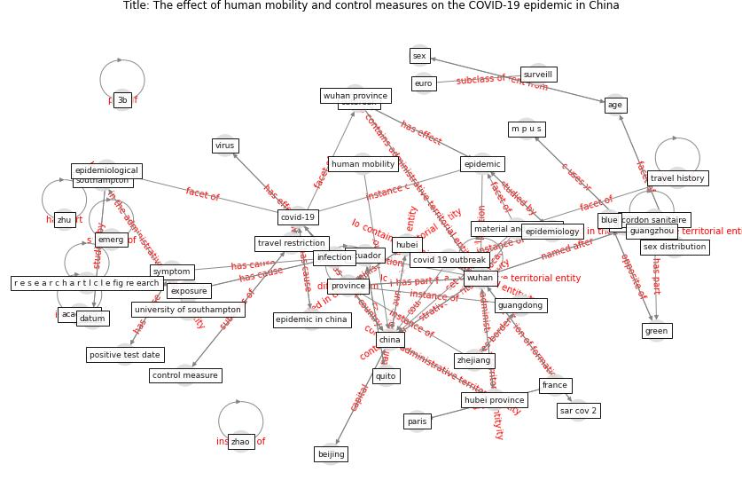

# Article: __The effect of human mobility and control measures on the COVID-19 epidemic in China__ (kraemer_effect_2020)

* [10.1126/science.abb4218](https://doi.org/10.1126/science.abb4218)
* Cluster: [liver-province](cluster_7)

## Keywords

[wuhan](keyword_wuhan), [china](keyword_china), [province](keyword_province), [hubei](keyword_hubei), [epidemic](keyword_epidemic)

## Abstract

Tracing infection from mobility data

What sort of measures are required to contain the spread of
severe acute respiratory syndrome–coronavirus 2
(SARS-CoV-2), which causes coronavirus disease 2019
(COVID-19)? The rich data from the Open COVID-19 Data
Working Group include the dates when people first reported
symptoms, not just a positive test date. Using these data
and real-time travel data from the internet services
company Baidu, Kraemer et al. found that mobility
statistics offered a precise record of the spread of
SARS-CoV-2 among the cities of China at the start of 2020.
The frequency of introductions from Wuhan were predictive
of the size of the epidemic sparked in other provinces.
However, once the virus had escaped Wuhan, strict local
control measures such as social isolation and hygiene,
rather than long-distance travel restrictions, played the
largest part in controlling SARS-CoV-2 spread.

Science , this issue p. 493

, Mobile phone data show that the spread of COVID-19 in
China was driven by travel and mitigated substantially by
local control measures. , The ongoing coronavirus disease
2019 (COVID-19) outbreak expanded rapidly throughout China.
Major behavioral, clinical, and state interventions were
undertaken to mitigate the epidemic and prevent the
persistence of the virus in human populations in China and
worldwide. It remains unclear how these unprecedented
interventions, including travel restrictions, affected
COVID-19 spread in China. We used real-time mobility data
from Wuhan and detailed case data including travel history
to elucidate the role of case importation in transmission
in cities across China and to ascertain the impact of
control measures. Early on, the spatial distribution of
COVID-19 cases in China was explained well by human
mobility data. After the implementation of control
measures, this correlation dropped and growth rates became
negative in most locations, although shifts in the
demographics of reported cases were still indicative of
local chains of transmission outside of Wuhan. This study
shows that the drastic control measures implemented in
China substantially mitigated the spread of COVID-19.

## Concepts

 

