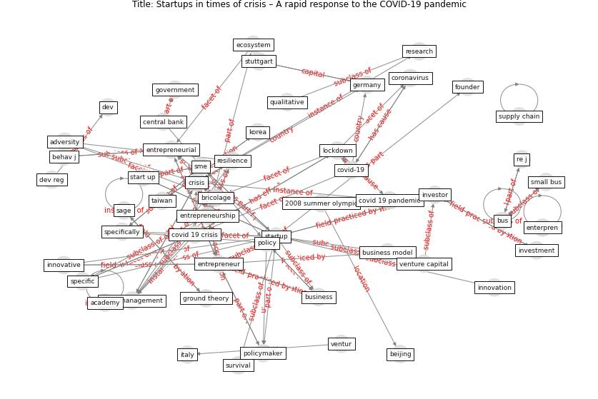

# Article: Startups in times of crisis – A rapid response to the COVID-19 pandemic (kuckertz_startups_2020)

* Source: [10.1016/j.jbvi.2020.e00169](https://doi.org/10.1016/j.jbvi.2020.e00169)
* Year: 2020
* Cluster: [construction-resilience](cluster_5)

## Keywords

 * 2008 summer olympic, 6_startup, [academy](keyword_academy), adversity, assure, [australia](keyword_australia), behav j, [beijing](keyword_beijing), bricolage, [bus](keyword_bus), [business](keyword_business), business failure, business model, central bank, cern, code, codebook, contingency, [coronavirus](keyword_coronavirus), [covid 19 crisis](keyword_covid_19_crisis), [covid 19 pandemic](keyword_covid_19_pandemic), [covid-19](keyword_covid-19), [crisis](keyword_crisis), crisis management, datum curation, dev, dev reg, document, economic activity, [ecosystem](keyword_ecosystem), educ, enterpren, [entrepreneur](keyword_entrepreneur), entrepreneurial, [entrepreneurship](keyword_entrepreneurship), european country, existential, formal analysis, founder, [germany](keyword_germany), [government](keyword_government), ground theory, handb, harv, hygiene, [infection control](keyword_infection_control), [innovation](keyword_innovation), innovative, interview, investment, investment round, investor, [italy](keyword_italy), jenny kowalsky, kfw, [korea](keyword_korea), [lockdown](keyword_lockdown), [london](keyword_london), [marketing](keyword_marketing), maybe, nurs, organ, organization, [pandemic](keyword_pandemic), pol, [policy](keyword_policy), policymaker, present, [qualitative](keyword_qualitative), qualitative research, rapid response research, re j, [research](keyword_research), [resilience](keyword_resilience), russia, sage, sale, series a, severe acute respiratory syndrome coronavirus 2, small bus, small business, [sme](keyword_sme), specific, specifically, start up, [startup](keyword_startup), strauss, stuttgart, [supply chain](keyword_supply_chain), survival, [taiwan](keyword_taiwan), [theme](keyword_theme), theor, theory, [united kingdom](keyword_united_kingdom), va, ventur, venture capital, [virus](keyword_virus), financial capital

## Concepts

 

## Neighbours

### Closest articles

* <scp>COVID</scp>             ‐19: Small and medium enterprises challenges and responses with creativity, innovation, and entrepreneurship - [LINK](article_thukral_covid19_2021)
* World Bank Development Report - [LINK](article_world_bank_world_2022)
* COVID-19 and regional solutions for mitigating the risk of SME finance in selected ASEAN member states - [LINK](article_taghizadeh-hesary_covid-19_2022)
* How COVID-19 Could Accelerate the Adoption of New Retail Technologies and Enhance the (E-)Servicescape - [LINK](article_willems_how_2021)
* Retail Signage During the COVID-19 Pandemic - [LINK](article_mcneish_retail_2020)
* Global value chains: Efficiency and risks in the context of COVID-19 - [LINK](article_oecd_global_2021)
* Covid-19 and asset management in EU: a preliminary assessment of performance and investment styles - [LINK](article_rizvi_covid-19_2020)
* Mapping research in logistics and supply chain management during COVID-19 pandemic - [LINK](article_montoya-torres_mapping_2021)
* The socio-economic implications of the coronavirus pandemic (COVID-19): A review - [LINK](article_nicola_socio-economic_2020)

### Closest BPs

* Blueprint: Smart Locker System - [LINK](bp_1)
* Blueprint: Rotational Shift System - [LINK](bp_0)
* Blueprint: One-way mobility circulation - [LINK](bp_4)
