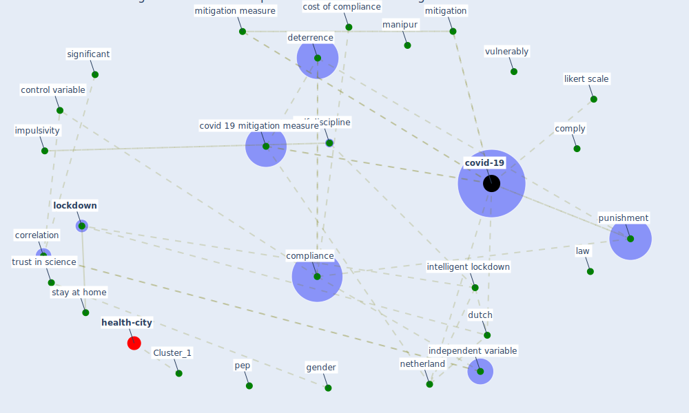

# Article: The Intelligent Lockdown: Compliance with COVID-19 Mitigation Measures in the Netherlands (kuiper_intelligent_2020)

* Source: [10.2139/ssrn.3598215](https://doi.org/10.2139/ssrn.3598215)
* Year: 2020
* Cluster: [construction-pandemic](cluster_1)

## Keywords

 * I o research, amsterdam, beach, behavioral, behaviour, benjamin, benjamin van rooij, cambridge, cambridge university press, [compliance](keyword_compliance), comply, conservative, control variable, correlation, cost of compliance, covid 19 measure, covid 19 mitigation measure, [covid 19 pandemic](keyword_covid_19_pandemic), [covid-19](keyword_covid-19), daniel d sokol, daniel s, descriptive statistic, [deterrence](keyword_deterrence), dutch, dutch prime minister, electronic, electronic copy, elizabeth cauffman, emotion, enforcement, [europe](keyword_europe), factor, francis t cullen, gender, impulsivity, independent variable, [india](keyword_india), ingo, insipidately, intelligent lockdown, intrinsic motivation, [italy](keyword_italy), [knowledge](keyword_knowledge), laila nockur, [law](keyword_law), liberal, likert scale, [lockdown](keyword_lockdown), [manipur](keyword_manipur), [measure](keyword_measure), michael bang petersen, [mitigation](keyword_mitigation), mitigation measure, [model](keyword_model), model 2, negative emotion, [netherland](keyword_netherland), neuropeptopreviously, non normative ool, normative, normative ool, opportunity, osf, park, [pep](keyword_pep), police, [policy](keyword_policy), pr 極, present study, prime minister, privatize, psychology, [public health](keyword_public_health), public venue, punishment, rapport, reverse score, robert böhm, rutte, réquisite, self control, self discipline, self report, significant, [social](keyword_social), stay at home, stefan, strain, strain theory, strongly agree, subscale, [survey](keyword_survey), threat, travis c, trust in science, [united kingdom](keyword_united_kingdom), universiteit twente, vulnerably, xxvi 证, xxx

## Concepts

 

## Neighbours

### Closest articles

* Compliance with COVID-19 Mitigation Measures in the United States - [LINK](article_van_rooij_compliance_2020)
* Mitigation strategies and compliance in the COVID-19 fight; how much compliance is enough? - [LINK](article_mukerjee_mitigation_2021)
* DfMA for rapid adaptive resilience and flexible infrastructure - [LINK](article_mott_macdonald_dfma_2020)
* Preparing critical infrastructure for the future: Lessons learnt from the Covid-19 pandemic - [LINK](article_tomalska_preparing_2022)
* COVID-19 as a Harbinger of Transforming Infrastructure Resilience - [LINK](article_carvalhaes_covid-19_2020)
* A comprehensive review on indoor air quality monitoring systems for enhanced public health - [LINK](article_saini_comprehensive_2020)
* A review of definitions and measures of system resilience - [LINK](article_hosseini_review_2016)
* COVID-19 and a new resilient infrastructure landscape - [LINK](article_oecd_covid-19_2021)
* Guidelines for resilience systems analysis - [LINK](article_oecd_guidelines_2014)
* How Can Blockchain Help People in the Event of Pandemics Such as the COVID-19? - [LINK](article_chang_how_2020)

### Closest BPs

* Blueprint: Antimicrobial Surfaces - [LINK](bp_5)
* Blueprint: Reducing contact points - [LINK](bp_17)
* Blueprint: Good hand hygiene practice - [LINK](bp_16)
