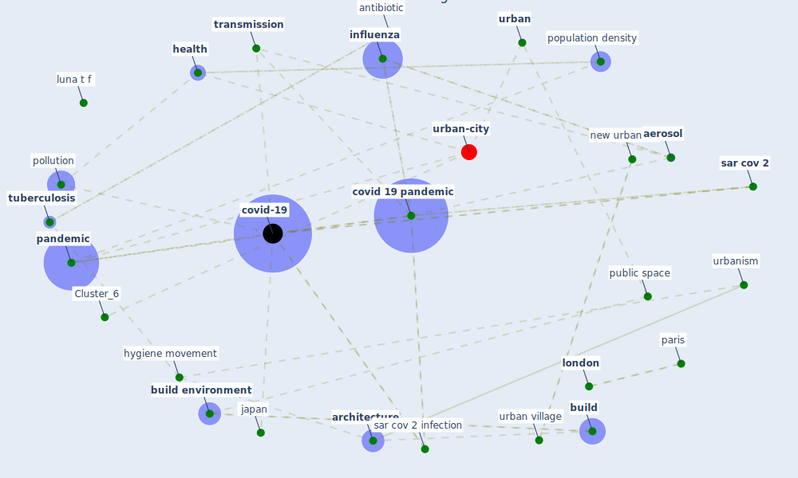

# Article: The Role of Architecture and Urbanism in Preventing Pandemics (kumar_role_2021)

* Source: [10.5772/intechopen.98294](https://doi.org/10.5772/intechopen.98294)
* Year: 2021
* Cluster: [urban-city](cluster_6)

## Keywords

 * [aerosol](keyword_aerosol), air control, [air pollution](keyword_air_pollution), akhtar r, algeria, allen t, [antibiotic](keyword_antibiotic), architectural, [architecture](keyword_architecture), ashare, [australia](keyword_australia), bherwani, bicycling, bonetti m, bucharest, [build](keyword_build), [build environment](keyword_build_environment), [building](keyword_building), [china](keyword_china), [city](keyword_city), costabile, [covid 19 pandemic](keyword_covid_19_pandemic), [covid-19](keyword_covid-19), [disease](keyword_disease), [droplet](keyword_droplet), ebenezer howard, elevator, emerge infectious disease, [environment](keyword_environment), [epidemic](keyword_epidemic), fan y, [france](keyword_france), francesca, french, front, garden city, ghoneim, green area, gupta p t, [health](keyword_health), health inequity, heat island, honey rose, hygiene, hygiene movement, hypermarket, [india](keyword_india), ineffective, [infection](keyword_infection), [influenza](keyword_influenza), intechopen, [japan](keyword_japan), [le corbusier](keyword_le_corbusier), leah, [london](keyword_london), luna t f, [manhattan](keyword_manhattan), medicine, [milan](keyword_milan), [model](keyword_model), [mortality](keyword_mortality), [neighborhood](keyword_neighborhood), [new jersey](keyword_new_jersey), [new south wale](keyword_new_south_wale), new urbanism, [new york city](keyword_new_york_city), [outbreak](keyword_outbreak), [pandemic](keyword_pandemic), paris, pollution, [population](keyword_population), population density, profession, [public space](keyword_public_space), roelants p, romania, [sar cov 2](keyword_sar_cov_2), sar cov 2 infection, [shop](keyword_shop), [social](keyword_social), song y, sprawl, sunlight, sustainable city, telecommute, the role of architecture and urbanism in preventing pandemics, [transmission](keyword_transmission), transportation, [trenton](keyword_trenton), [tuberculosis](keyword_tuberculosis), [united states](keyword_united_states), [urban](keyword_urban), urban village, [urbanism](keyword_urbanism), [vaccine](keyword_vaccine), [ventilation](keyword_ventilation), [virus](keyword_virus), walk, wong j, zoonotic

## Concepts

 

## Neighbours

### Closest articles

* Coronavirus questions that will not go away: interrogating urban and socio-spatial implications of COVID-19 measures - [LINK](article_salama_coronavirus_2020)
* Antivirus-built environment: Lessons learned from Covid-19 pandemic - [LINK](article_megahed_antivirus-built_2020)
* Impact of Covid-19 on the built environment - [LINK](article_mahima_impact_2022)
* The Impact of COVID-19 on Public Space: A Review of the Emerging Questions - [LINK](article_honey-roses_impact_2020)
* COVID-19 Pandemic: Rethinking Strategies for Resilient Urban Design, Perceptions, and Planning - [LINK](article_afrin_covid-19_2021)
* Respiratory pandemics, urban planning and design: A multidisciplinary rapid review of the literature - [LINK](article_harris_respiratory_2022)
* Epidemics, Planning and the City: A Special Issue of Planning Perspectives - [LINK](article_davis_epidemics_2022)
* The COVID-19 pandemic: Impacts on cities and major lessons for urban planning, design, and management - [LINK](article_sharifi_covid-19_2020)
* COVID-19 Could Leverage a Sustainable Built Environment - [LINK](article_pinheiro_covid-19_2020)
* Houses amid COVID-19: Environmental challenges and design adaptation - [LINK](article_hizra_houses_2021)

### Closest BPs

* Blueprint: Smart Locker System - [LINK](bp_1)
* Blueprint: Tracking and enforcing use of Personal Protective Equipment - [LINK](bp_23)
* Blueprint: Building Adaptation during a pandemic - [LINK](bp_14)
