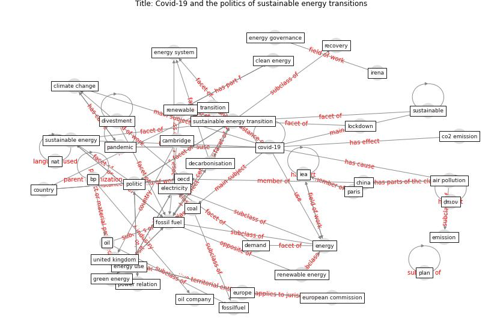

# Article: Covid-19 and the politics of sustainable energy transitions (kuzemko_covid-19_2020)

* Source: [10.1016/j.erss.2020.101685](https://doi.org/10.1016/j.erss.2020.101685)
* Year: 2020
* Cluster: [construction-resilience](cluster_5)

## Keywords

 * [air pollution](keyword_air_pollution), behaviour, bp, c kuzemko, [cambridge](keyword_cambridge), car, [china](keyword_china), clean energy, [climate change](keyword_climate_change), co2 emission, coal, compete interest, [coronavirus](keyword_coronavirus), [country](keyword_country), [covid 19 crisis](keyword_covid_19_crisis), [covid-19](keyword_covid-19), cycling, decarbonisation, decelerate, declaration of compete interest, demand, demand shock, div away from fossil fuel, divestment, economic growth, economic recovery, [economy](keyword_economy), electricity, emerge economy, emission, [energy](keyword_energy), energy efficiency, energy governance, energy mix, energy policy, energy system, energy system change, [energy use](keyword_energy_use), equity, eu member state, [europe](keyword_europe), european commission, [fossil fuel](keyword_fossil_fuel), fossil fuel industry, fossilfuel, gas, global warming of 1 5 c, green energy, [iea](keyword_iea), [industry](keyword_industry), ipcc, irena, job, livelihood, [lockdown](keyword_lockdown), mineral, nat, norway, [oecd](keyword_oecd), oil, oil company, [pandemic](keyword_pandemic), paris, paris agreement, [plan](keyword_plan), [policy](keyword_policy), politic, politicalparticipation, post-pandemic, power relation, price crash, production line, [public](keyword_public), [public transport](keyword_public_transport), re scale ipe local government sustainable energy and change, [recovery](keyword_recovery), renewable, renewable energy, [researcher](keyword_researcher), s laville, [sector](keyword_sector), short term, social practice, [social science](keyword_social_science), supply, [supply chain](keyword_supply_chain), surface transport, susceptibility of solar energy supply chain, [sustainable](keyword_sustainable), sustainable energy, [sustainable energy transition](keyword_sustainable_energy_transition), the history and politic of energy transition compare contestedview and find common ground, transition, transnational, [transport](keyword_transport), [united kingdom](keyword_united_kingdom), walk, we oil price, ḍπιον, financial practice

## Concepts

 

## Neighbours

### Closest articles

* Contextualizing the Covid-19 pandemic for a carbon-constrained world: Insights for sustainability transitions, energy justice, and research methodology - [LINK](article_sovacool_contextualizing_2020)
* Validity of energy social research during and after COVID-19: challenges, considerations, and responses - [LINK](article_fell_validity_2020)
* Addressing the impact of COVID-19 lockdown on energy use in municipal buildings: A case study in Florianópolis, Brazil - [LINK](article_geraldi_addressing_2021)
* Impacts of COVID-19 on residential building energy use and performance - [LINK](article_kawka_impacts_2021)
* Occupants’ behavior and activity patterns influencing the energy consumption in the Kuwaiti residences - [LINK](article_al-mumin_occupants_2003)
* Reflecting on Impacts of COVID19 on Sustainable Buildings and Cities - [LINK](article_gonzalez_reflecting_2021)
* The effect of occupant distribution on energy consumption and COVID-19 infection in buildings: A case study of university building - [LINK](article_mokhtari_effect_2021)
* Assessment of Building Automation and Control Systems in Danish Healthcare Facilities in the COVID-19 Era - [LINK](article_pedersen_assessment_2022)
* COVID-19 Forced Hospitals to Build Negative Pressure Rooms Fast - [LINK](article_dyer_covid-19_2020)
* The Effect of Opening Windows on Air Change Rates in Two Homes - [LINK](article_howard-reed_effect_2002)

### Closest BPs

* Blueprint: Negative pressure rooms - [LINK](bp_13)
* Blueprint: Air Cleaning Plants - [LINK](bp_15)
* Blueprint: Installing UV in ductwork - [LINK](bp_10)
