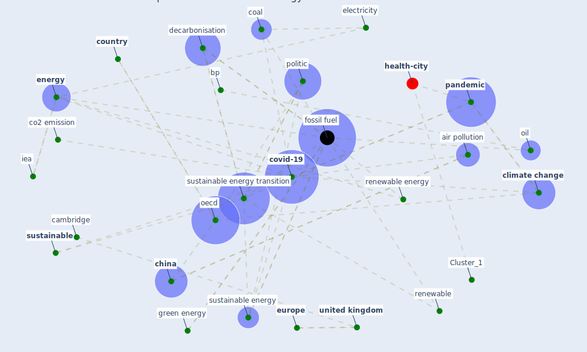

# Article: Covid-19 and the politics of sustainable energy transitions (kuzemko_covid-19_2020)

* Source: [10.1016/j.erss.2020.101685](https://doi.org/10.1016/j.erss.2020.101685)
* Year: 2020
* Cluster: [construction-pandemic](cluster_1)

## Keywords

 * a d bazilian, a goldthau, a new world the geopolitic of the energy transformation, accelerate, [air pollution](keyword_air_pollution), behaviour, bp, bp online news, cambridge, car, [china](keyword_china), clean energy, [climate change](keyword_climate_change), co2, co2 emission, coal, compete interest, [coronavirus](keyword_coronavirus), [country](keyword_country), [covid-19](keyword_covid-19), [cycling](keyword_cycling), decarbonisation, decelerate, declaration of compete interest, demand, demand shock, div away from fossil fuel, divestment, economic growth, economic recovery, [economy](keyword_economy), electricity, emerge economy, emission, [energy](keyword_energy), energy efficiency, energy governance, energy installation, energy mix, energy policy, energy system, energy system change, energy use, equity, eu member state, [europe](keyword_europe), european commission, [fossil fuel](keyword_fossil_fuel), fossilfuel, gas, glasgow, [government](keyword_government), green energy, [iea](keyword_iea), irena, job, livelihood, [lockdown](keyword_lockdown), low carbon energy system, mineral, nat, [new york city](keyword_new_york_city), norm, [oecd](keyword_oecd), oil, oil company, oil price crash, [pandemic](keyword_pandemic), paris, paris agreement, [plan](keyword_plan), [policy](keyword_policy), politic, politicalparticipation, post-pandemic, power relation, price crash, [public](keyword_public), [public transport](keyword_public_transport), [recovery](keyword_recovery), renewable, renewable energy, [sector](keyword_sector), short term, [supply chain](keyword_supply_chain), surface transport, susceptibility of solar energy supply chain, sustainable, sustainable energy, [sustainable energy transition](keyword_sustainable_energy_transition), the history and politic of energy transition compare contestedview and find common ground, transition, [transport](keyword_transport), [travel](keyword_travel), uncertainty, [united kingdom](keyword_united_kingdom), walk, [workplace](keyword_workplace), write o, ḍπιον

## Concepts

 

## Neighbours

### Closest articles

* Contextualizing the Covid-19 pandemic for a carbon-constrained world: Insights for sustainability transitions, energy justice, and research methodology - [LINK](article_sovacool_contextualizing_2020)
* Validity of energy social research during and after COVID-19: challenges, considerations, and responses - [LINK](article_fell_validity_2020)
* Addressing the impact of COVID-19 lockdown on energy use in municipal buildings: A case study in Florianópolis, Brazil - [LINK](article_geraldi_addressing_2021)
* Impacts of COVID-19 on residential building energy use and performance - [LINK](article_kawka_impacts_2021)
* Reflecting on Impacts of COVID19 on Sustainable Buildings and Cities - [LINK](article_gonzalez_reflecting_2021)
* Occupants’ behavior and activity patterns influencing the energy consumption in the Kuwaiti residences - [LINK](article_al-mumin_occupants_2003)
* The effect of occupant distribution on energy consumption and COVID-19 infection in buildings: A case study of university building - [LINK](article_mokhtari_effect_2021)
* Assessment of Building Automation and Control Systems in Danish Healthcare Facilities in the COVID-19 Era - [LINK](article_pedersen_assessment_2022)
* Ten questions concerning occupant health in buildings during normal operations and extreme events including the COVID-19 pandemic - [LINK](article_awada_ten_2021)
* How to Make Green Building Certification &amp; Rating Systems More Pandemic-Sustainable? - [LINK](article_ujikawa_how_2022)

### Closest BPs

* Blueprint: nan - [LINK](bp_34)
* Blueprint: Tender support at building stage - [LINK](bp_9)
* Blueprint: Building Adaptation during a pandemic - [LINK](bp_14)
