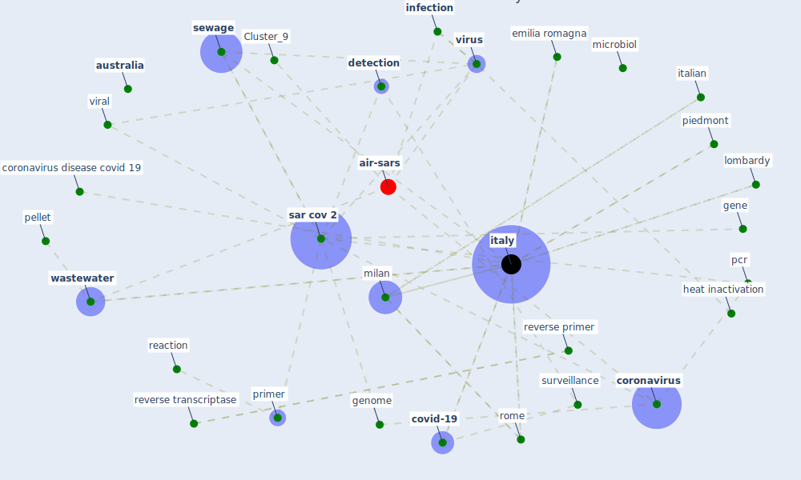

# Article: First detection of SARS-CoV-2 in untreated wastewaters in Italy (la_rosa_first_2020)

* Source: [10.1016/j.scitotenv.2020.139652](https://doi.org/10.1016/j.scitotenv.2020.139652)
* Year: 2020
* Cluster: [wastewater-water](cluster_0)

## Keywords

 * I g h t s g r a p h, [assay](keyword_assay), asymptomatic, [australia](keyword_australia), bergamo, [clinical](keyword_clinical), confirme, [coronavirus](keyword_coronavirus), coronavirus disease covid 19, [covid-19](keyword_covid-19), cremona, [detection](keyword_detection), dextran, duplicate, effective heat inactivation, emilia romagna, [engineering](keyword_engineering), [epidemiology](keyword_epidemiology), food environ virol, genbank, [gene](keyword_gene), genogroup ii, [genome](keyword_genome), genomic, gisaid, github, grassin, heat inactivation, inactivation, [infection](keyword_infection), inmi, [influent](keyword_influent), io, italian, [italy](keyword_italy), latium, leclercq, lod, lodi, lombardy, manuscript, marechal, mega x, mengovirus, microbe, [microbiol](keyword_microbiol), microbiologist, [milan](keyword_milan), mouchel, muscillo, nc_045512, negative control, nest pcr, nest rt pcr assay, [nih](keyword_nih), noroviru, nucleic acid, o bannon, orf1ab, [pandemic](keyword_pandemic), pastorino, [pathogen](keyword_pathogen), [pcr](keyword_pcr), pellet, piedmont, platinum, pmcid, population equivalent, positive, [primer](keyword_primer), primer probe, primer set, rdrp, reaction, reverse primer, reverse transcriptase, reverse transcription, [rna](keyword_rna), [rome](keyword_rome), s g r a p h, [sar cov 2](keyword_sar_cov_2), sar cov2 rna, science, severe acute respiratory syndrome coronavirus 2, [sewage](keyword_sewage), sinclair, specific, spike, [surveillance](keyword_surveillance), [usa](keyword_usa), [viral](keyword_viral), virological, [virus](keyword_virus), [wastewater](keyword_wastewater), wastewater base epidemiology, [water](keyword_water), water quality, woman in water quality, [wwtp](keyword_wwtp), first pcr

## Concepts

 

## Neighbours

### Closest articles

* Presence of SARS-Coronavirus-2 RNA in Sewage and Correlation with Reported COVID-19 Prevalence in the Early Stage of the Epidemic in The Netherlands - [LINK](article_medema_presence_2020)
* Detection of SARS-CoV-2 in raw and treated wastewater in Germany – Suitability for COVID-19 surveillance and potential transmission risks - [LINK](article_westhaus_detection_2021)
* Wastewater-Based Epidemiology to monitor COVID-19 outbreak: Present and future diagnostic methods to be in your radar - [LINK](article_barcelo_wastewater-based_2020)
* SARS-CoV-2 Titers in Wastewater Are Higher than Expected from Clinically Confirmed Cases - [LINK](article_wu_sars-cov-2_2020)
* SARS-CoV-2 RNA in wastewater anticipated COVID-19 occurrence in a low prevalence area - [LINK](article_randazzo_sars-cov-2_2020)
* First confirmed detection of SARS-CoV-2 in untreated wastewater in Australia: A proof of concept for the wastewater surveillance of COVID-19 in the community - [LINK](article_ahmed_first_2020)
* A Continuously Active Antimicrobial Coating effective against Human Coronavirus 229E - [LINK](article_ikner_continuously_2020)
* The removal of airborne SARS-CoV-2 and other microbial bioaerosols by air filtration on COVID-19 surge units - [LINK](article_conway-morris_removal_2021)
* A Surface Coating that Rapidly Inactivates SARS-CoV-2 - [LINK](article_behzadinasab_surface_2020)

### Closest BPs

* Blueprint: Negative pressure rooms - [LINK](bp_13)
* Blueprint: Smart Locker System - [LINK](bp_1)
* Blueprint: Rotational Shift System - [LINK](bp_0)
