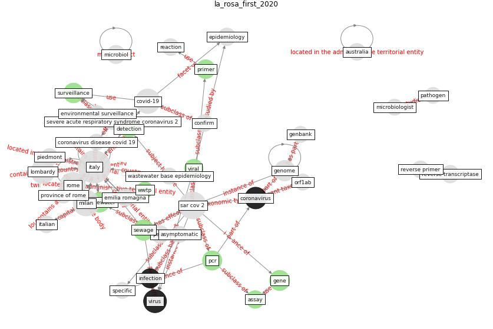

# Article: First detection of SARS-CoV-2 in untreated wastewaters in Italy (la_rosa_first_2020)

* Source: [10.1016/j.scitotenv.2020.139652](https://doi.org/10.1016/j.scitotenv.2020.139652)
* Year: 2020
* Cluster: [wastewater-sars](cluster_2)

## Keywords

 * 56 c, I g h t s g r a p h, amplicon size, [assay](keyword_assay), asymptomatic, [australia](keyword_australia), bergamo, clinical, clinical setting, confirme, [coronavirus](keyword_coronavirus), coronavirus disease covid 19, [covid-19](keyword_covid-19), cremona, [detection](keyword_detection), dextran, duplicate, effective heat inactivation, emilia romagna, [engineering](keyword_engineering), environmental surveillance, [epidemiology](keyword_epidemiology), food environ virol, [france](keyword_france), genbank, [gene](keyword_gene), genogroup ii, [genome](keyword_genome), genomic, gisaid, github, grassin, heat inactivation, [inactivation](keyword_inactivation), [infection](keyword_infection), inmi, [influent](keyword_influent), italian, [italy](keyword_italy), lod, lodi, lombardy, mega x, mengovirus, microbe, [microbiol](keyword_microbiol), microbiologist, [milan](keyword_milan), muscillo, nc_045512, negative control, nest pcr, nest rt pcr assay, [nih](keyword_nih), noroviru, orf1ab, [pandemic](keyword_pandemic), [pathogen](keyword_pathogen), [pcr](keyword_pcr), pellet, [personal protective equipment](keyword_personal_protective_equipment), piedmont, [primer](keyword_primer), primer probe, publish correction, rdrp, reaction, reteste, reverse primer, reverse transcriptase, reverse transcription, [rna](keyword_rna), [rome](keyword_rome), rt pcr, rt qpcr, s g r a p h, [sar cov 2](keyword_sar_cov_2), sar cov2 rna, science, severe acute respiratory syndrome coronavirus 2, [sewage](keyword_sewage), sewage surveillance, sinclair, specific, spike, [surveillance](keyword_surveillance), thermal treatment, touret, [usa](keyword_usa), [viral](keyword_viral), viral outbreak, virological, [virus](keyword_virus), [wastewater](keyword_wastewater), wastewater base epidemiology, [water](keyword_water), water quality, woman in water quality, [wwtp](keyword_wwtp), first pcr

## Concepts

 

## Neighbours

### Closest articles

* SARS-CoV-2 RNA in wastewater anticipated COVID-19 occurrence in a low prevalence area - [LINK](article_randazzo_sars-cov-2_2020)
* Presence of SARS-Coronavirus-2 RNA in Sewage and Correlation with Reported COVID-19 Prevalence in the Early Stage of the Epidemic in The Netherlands - [LINK](article_medema_presence_2020)
* SARS-CoV-2 Titers in Wastewater Are Higher than Expected from Clinically Confirmed Cases - [LINK](article_wu_sars-cov-2_2020)
* Wastewater-Based Epidemiology to monitor COVID-19 outbreak: Present and future diagnostic methods to be in your radar - [LINK](article_barcelo_wastewater-based_2020)
* Detection of SARS-CoV-2 in raw and treated wastewater in Germany – Suitability for COVID-19 surveillance and potential transmission risks - [LINK](article_westhaus_detection_2021)
* First confirmed detection of SARS-CoV-2 in untreated wastewater in Australia: A proof of concept for the wastewater surveillance of COVID-19 in the community - [LINK](article_ahmed_first_2020)
* Computational analysis of SARS-CoV-2/COVID-19 surveillance by wastewater-based epidemiology locally and globally: Feasibility, economy, opportunities and challenges - [LINK](article_hart_computational_2020)
* Future perspectives of wastewater-based epidemiology: Monitoring infectious disease spread and resistance to the community level - [LINK](article_sims_future_2020)
* Wastewater surveillance for population-wide Covid-19: The present and future - [LINK](article_daughton_wastewater_2020)
* SARS-CoV-2 in wastewater: potential health risk, but also data source - [LINK](article_lodder_sars-cov-2_2020)

### Closest BPs

* Blueprint: Monitoring of wastewater [CID] - [LINK](bp_21)
* Blueprint: Negative pressure rooms - [LINK](bp_13)
* Blueprint: Resilience in staffing and skills training - [LINK](bp_12)
