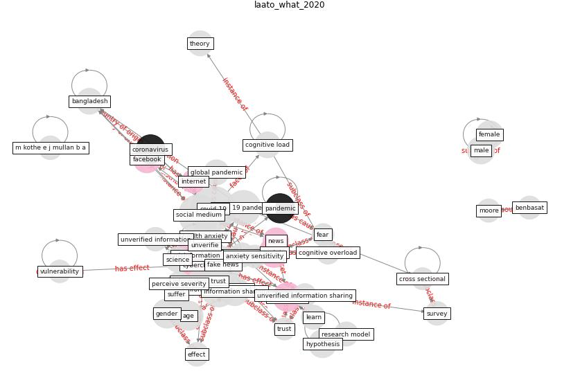

# Article: What drives unverified information sharing and cyberchondria during the COVID-19 pandemic? (laato_what_2020)

* Source: [10.1080/0960085X.2020.1770632](https://doi.org/10.1080/0960085X.2020.1770632)
* Year: 2020
* Cluster: [health-patient](cluster_14)

## Keywords

 * addiction, age, [anxiety](keyword_anxiety), anxiety sensitivity, ave, bakshy, bangladesh, behaviour, benbasat, berle, bhagavathula, chen et, [china](keyword_china), cime, cognitive load, cognitive load theory, cognitive overload, construct, confirmation bias, [corona](keyword_corona), [coronavirus](keyword_coronavirus), coronavirus covid 19, covid 19 infodemic, covid 19 misinformation, [covid 19 pandemic](keyword_covid_19_pandemic), [covid-19](keyword_covid-19), cross loading, cross sectional, cyber3, [cyberchondria](keyword_cyberchondria), [education](keyword_education), effect, [facebook](keyword_facebook), factor, [fake news](keyword_fake_news), fatigue, [fear](keyword_fear), female, [finland](keyword_finland), gender, gwyther, health anxiety, health belief model, horvitz, hypothesis, [information](keyword_information), [information overload](keyword_information_overload), information sharing, information technology, information trust, [internet](keyword_internet), islam, karanasio, kaur, key finding, [knowledge](keyword_knowledge), larker, learn, liang, ljubljana, loading, m kothe e j mullan b a, male, method factor, [misinformation](keyword_misinformation), mistrust, moore, [news](keyword_news), news source, norr a, [pandemic](keyword_pandemic), participant, perceive severity, perceive threat, premium, protection motivation theory, psychology, research model, rovetta, science, [slovenia](keyword_slovenia), spada, [spread](keyword_spread), square root, survey, suffere, systematic review, talwar, theory, trust, uncertainty, university press, unverified, unverified information, unverified information sharing, valensise, validity, variance, [vulnerability](keyword_vulnerability), zollo

## Concepts

 

## Neighbours

### Closest articles

* The changes in the effects of social media use of Cypriots due to COVID-19 pandemic - [LINK](article_kaya_changes_2020)
* COVID-19 misinformation: Accuracy of articles about coronavirus prevention mostly shared on social media - [LINK](article_obiala_covid-19_2021)
* COVID-19 media fatigue: predictors of decreasing interest and avoidance of COVID-19–related news - [LINK](article_buneviciene_covid-19_2021)
* Coronavirus: Can artificial intelligence be smart enough to detect fake news? - [LINK](article_tong_coronavirus_2020)
* Infodemic and the spread of fake news in the COVID-19-era - [LINK](article_orso_infodemic_2020)
* The COVID-19 Impact on Flexible Office Space - [LINK](article_clifton_covid-19_2020)
* The impacts of knowledge, risk perception, emotion and information on citizens’ protective behaviors during the outbreak of COVID-19: a cross-sectional study in China - [LINK](article_ning_impacts_2020)
* An investigation of transmission control measures during the first 50 days of the COVID-19 epidemic in China - [LINK](article_tian_investigation_2020)
* The effect of human mobility and control measures on the COVID-19 epidemic in China - [LINK](article_kraemer_effect_2020)
* Knowledge, attitudes, and practices of Indonesian residents regarding COVID-19: A national cross-sectional survey - [LINK](article_yodang_knowledge_2021)

### Closest BPs

* Blueprint: Resilience in staffing and skills training - [LINK](bp_12)
* Blueprint: Monitoring of wastewater - [LINK](bp_21)
* Blueprint: Installing UV in ductwork - [LINK](bp_10)
