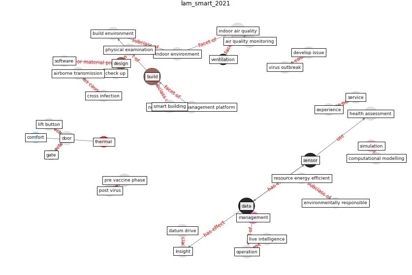

# Article: __Smart buildings: how a virus might lead to healthier buildings - Arup__ (lam_smart_2021)

* URL: [https://www.arup.com/en/perspectives/smart-buildings-how-a-virus-might-lead-to-healthier-buildings](https://www.arup.com/en/perspectives/smart-buildings-how-a-virus-might-lead-to-healthier-buildings)
* Year: 2021
* Abstract: Across the built environment, the Coronavirus pandemic is
leading to a focus on healthy indoor environments,
particularly social locations and workplaces. We have
formulated a four-step strategy for indoor environmental
improvements, one that safeguards the health and wellbeing
of occupants.

## Keywords

[build](keyword_build), [data](keyword_data), [sensor](keyword_sensor), [pandemic](keyword_pandemic)

## Concepts

 

