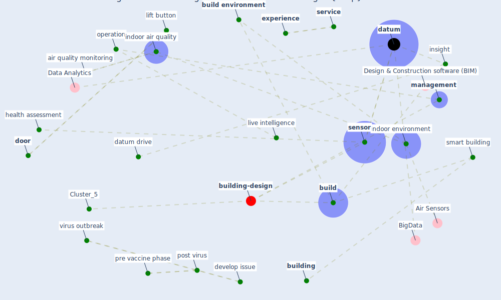

# Article: Smart buildings: how a virus might lead to healthier buildings - Arup (lam_smart_2021)

* [https://www.arup.com/en/perspectives/smart-buildings-how-a-virus-might-lead-to-healthier-buildings](https://www.arup.com/en/perspectives/smart-buildings-how-a-virus-might-lead-to-healthier-buildings)
* Year: 2021
* Cluster: [building-design](cluster_5)

## Keywords

 * 2008 summer olympic, [air conditioning](keyword_air_conditioning), air purification, air quality monitoring, [airborne](keyword_airborne), airborne transmission, [analytic](keyword_analytic), anti viral, [area](keyword_area), behaviour, [beijing](keyword_beijing), [build](keyword_build), [build environment](keyword_build_environment), build management, [building](keyword_building), building adapt quickly to health challenge, building manager, building of tomorrow, building of tomorrow the virus, carbon dioxide, [coating](keyword_coating), comfort, [covid-19](keyword_covid-19), cross infection, current pandemic, [datum](keyword_datum), datum analytic, datum drive, [design](keyword_design), develop issue, developer, [door](keyword_door), door handle, east asia, energy efficient, environmentally responsible, [experience](keyword_experience), fine particulate matter, [gate](keyword_gate), health assessment, health challenge, heating, high touch surface, [indoor air quality](keyword_indoor_air_quality), indoor air quality iaq, [indoor environment](keyword_indoor_environment), insight, invest, investment, [landlord](keyword_landlord), lift button, live intelligence, [management](keyword_management), [mitigation](keyword_mitigation), mitigation measure, [monitor](keyword_monitor), mortar, neuron, neuron building management platform, new standard, new well, new well standard, occupant behaviour, operation, operator, owner, owner of any public building, paint, [pandemic](keyword_pandemic), philadelphia, [platform](keyword_platform), [pollutant](keyword_pollutant), [pollution](keyword_pollution), pollution level, post virus, post virus pre vaccine phase, pre vaccine phase, priority set, resource energy efficient, [risk](keyword_risk), [sensor](keyword_sensor), [service](keyword_service), [smart building](keyword_smart_building), software, software creation, [standard](keyword_standard), [surface](keyword_surface), [sustainable](keyword_sustainable), [system](keyword_system), thermal, tucson, university of arizona, university of pennsylvania, [uv light](keyword_uv_light), [ventilation](keyword_ventilation), virus outbreak, [vocs](keyword_vocs)

## Concepts

 

## Neighbours

### Closest articles

* Designing Post COVID-19 Buildings: Approaches for Achieving Healthy Buildings - [LINK](article_navaratnam_designing_2022)
* Ten questions concerning occupant health in buildings during normal operations and extreme events including the COVID-19 pandemic - [LINK](article_awada_ten_2021)
* Occupant health in buildings: Impact of the COVID-19 pandemic on the opinions of building professionals and implications on research - [LINK](article_awada_occupant_2022)
* Indoor Air Quality: Rethinking rules of building design strategies in post-pandemic architecture - [LINK](article_megahed_indoor_2021)
* Health, Wellbeing \& Productivity in Offices - [LINK](article_world_green_building_council_health_2014)
*  - [LINK](article_yakubu_aminu_dodo_green_2020)
* The contribution of green buildings in the fight against COVID-19 - [LINK](article_world_green_building_council_contribution_2020)
* The effect of a redesigned floor plan, occupant density and the quality of indoor climate on the cost of space, productivity and sick leave in an office building–A case study - [LINK](article_saari_effect_2006)
* Reflecting on Impacts of COVID19 on Sustainable Buildings and Cities - [LINK](article_gonzalez_reflecting_2021)
* Assessment of Building Automation and Control Systems in Danish Healthcare Facilities in the COVID-19 Era - [LINK](article_pedersen_assessment_2022)

### Closest BPs

* Blueprint: Indoor Environmental Quality (IEQ) monitoring system - [LINK](bp_3)
* Blueprint: Monitoring of wastewater - [LINK](bp_21)
* Blueprint: Air Cleaning Plants - [LINK](bp_15)
