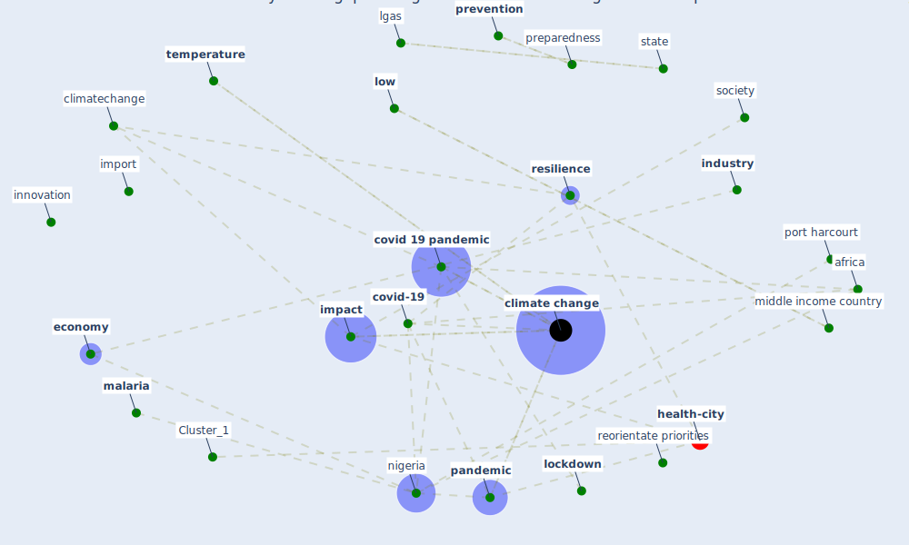

# Article: COVID-19 risks and systemic gaps in Nigeria: resilience building lessons for pandemic and climate change management (lawal_covid-19_2022)

* Source: [10.1007/s43545-022-00557-8](https://doi.org/10.1007/s43545-022-00557-8)
* Year: 2022
* Cluster: [resilience-infrastructure](cluster_11)

## Keywords

 * [africa](keyword_africa), aminu k, amzat j, amzatet, bambra c, carbon footprint, [climate change](keyword_climate_change), climate change adaptation, climatechange, [community](keyword_community), [coronavirus](keyword_coronavirus), [covid 19 pandemic](keyword_covid_19_pandemic), [covid-19](keyword_covid-19), death, deforestation, department, develop country, disaster, [disease](keyword_disease), disinformation, distributive, drought, ebola, [economic](keyword_economic), economic development, economic grounding, economic shock, [economy](keyword_economy), [education](keyword_education), ejigbo, federal, food insecurity, funding, geojournal, [health](keyword_health), illness, [impact](keyword_impact), impact of climate change, import, [index case](keyword_index_case), [india](keyword_india), [industry](keyword_industry), inequality, [infrastructure](keyword_infrastructure), [innovation](keyword_innovation), interrelationship, lgas, [lockdown](keyword_lockdown), loss, [low](keyword_low), maeda jm, [malaria](keyword_malaria), mathieu e, middle income country, [misinformation](keyword_misinformation), new delhi, [new south wale](keyword_new_south_wale), [nigeria](keyword_nigeria), nkengasong jn, osun state, [pandemic](keyword_pandemic), perathoner s, [policy](keyword_policy), pollution, port harcourt, poverty, preparedness, [prevention](keyword_prevention), prioritised, problem, pu j, public education, quantifying the influence of climate on human conflict, reorientate priorities, [research](keyword_research), [resilience](keyword_resilience), resilience building, riordan r, [risk](keyword_risk), risk society theory, ritchie h, rivers state, [social](keyword_social), societal, [society](keyword_society), [spread](keyword_spread), [state](keyword_state), [student](keyword_student), [sustainable development](keyword_sustainable_development), [sustainable development goal](keyword_sustainable_development_goal), systemic gap, [temperature](keyword_temperature), [united nations](keyword_united_nations), university of port harcourt, [vaccine](keyword_vaccine), value chain, [vector](keyword_vector), violent crime, [vulnerability](keyword_vulnerability), wang z

## Concepts

 

## Neighbours

### Closest articles

* Navigating Climate Change: Rethinking the Role of Buildings - [LINK](article_cole_navigating_2020)
* What our response to the COVID-19 pandemic tells us of our capacity to respond to climate change - [LINK](article_gemenne_what_2020)
* Coronavirus and Climate Change - [LINK](article_harvard_th_chan_schoold_of_public_health_coronavirus_2020)
*  - [LINK](article_yakubu_aminu_dodo_green_2020)
* Revisiting the built environment: 10 potential development changes and paradigm shifts due to COVID-19 - [LINK](article_cheshmehzangi_revisiting_2021)
* The Smart City and Covid‐19 - [LINK](article_webb_smart_2020)
* Smart cities and the pandemic: digital technologies on the urban management of Brazilian cities - [LINK](article_fariniuk_smart_2020)
* The three modes of existence of the pandemic smart city - [LINK](article_soderstrom_three_2021)
* Smart cities and a data-driven response to COVID-19 - [LINK](article_james_smart_2020)

### Closest BPs

* Blueprint: Smart Locker System - [LINK](bp_1)
* Blueprint: Mental health – Belong: Do something with someone - [LINK](bp_19)
* Blueprint: Mental health – Act: Do something - [LINK](bp_18)
