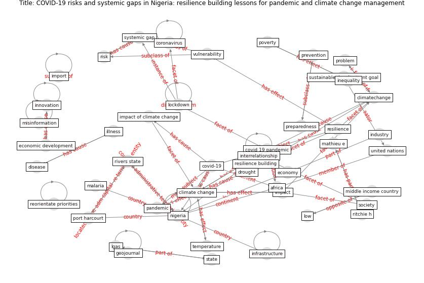

# Article: COVID-19 risks and systemic gaps in Nigeria: resilience building lessons for pandemic and climate change management (lawal_covid-19_2022)

* Source: [10.1007/s43545-022-00557-8](https://doi.org/10.1007/s43545-022-00557-8)
* Year: 2022
* Cluster: [construction-resilience](cluster_5)

## Keywords

 * [africa](keyword_africa), aminu k, amzat j, amzatet, bambra c, carbon footprint, [climate change](keyword_climate_change), climate change adaptation, climatechange, [community](keyword_community), [coronavirus](keyword_coronavirus), [covid 19 pandemic](keyword_covid_19_pandemic), [covid-19](keyword_covid-19), death, deforestation, department, develop country, disaster, [disease](keyword_disease), disinformation, distributive, drought, ebola, [economic](keyword_economic), economic development, economic grounding, economic shock, [economy](keyword_economy), [education](keyword_education), ejigbo, federal, food insecurity, funding, geojournal, [health](keyword_health), illness, [impact](keyword_impact), impact of climate change, import, [index case](keyword_index_case), [india](keyword_india), [industry](keyword_industry), inequality, [infrastructure](keyword_infrastructure), [innovation](keyword_innovation), interrelationship, lgas, [lockdown](keyword_lockdown), loss, [low](keyword_low), maeda jm, [malaria](keyword_malaria), mathieu e, middle income country, [misinformation](keyword_misinformation), new delhi, [new south wale](keyword_new_south_wale), [nigeria](keyword_nigeria), nkengasong jn, osun state, [pandemic](keyword_pandemic), perathoner s, [policy](keyword_policy), pollution, port harcourt, poverty, preparedness, prevention, prioritised, problem, pu j, public education, quantifying the influence of climate on human conflict, reorientate priorities, [research](keyword_research), [resilience](keyword_resilience), resilience building, riordan r, [risk](keyword_risk), risk society theory, ritchie h, rivers state, [social](keyword_social), societal, [society](keyword_society), [spread](keyword_spread), [state](keyword_state), [student](keyword_student), [sustainable development](keyword_sustainable_development), [sustainable development goal](keyword_sustainable_development_goal), systemic gap, [temperature](keyword_temperature), [united nations](keyword_united_nations), university of port harcourt, [vaccine](keyword_vaccine), value chain, [vector](keyword_vector), violent crime, [vulnerability](keyword_vulnerability), wang z

## Concepts

 

## Neighbours

### Closest articles

* Public housing and COVID-19: contestation, challenge and change - [LINK](article_power_public_2020)
* Urban design attributes and resilience: COVID-19 evidence from New York City - [LINK](article_yang_urban_2021)
* Dangerous liaisons? Applying the social harm perspective to the social inequality, housing and health trifecta during the Covid-19 pandemic - [LINK](article_gurney_dangerous_2021)
* Eviction, Health Inequity, and the Spread of COVID-19: Housing Policy as a Primary Pandemic Mitigation Strategy - [LINK](article_benfer_eviction_2021)
* The Role of Architecture and Urbanism in Preventing Pandemics - [LINK](article_kumar_role_2021)
* Coronavirus questions that will not go away: interrogating urban and socio-spatial implications of COVID-19 measures - [LINK](article_salama_coronavirus_2020)
* Association of built environment attributes with the spread of COVID-19 at its initial stage in China - [LINK](article_li_association_2021)
* Epidemics, Planning and the City: A Special Issue of Planning Perspectives - [LINK](article_davis_epidemics_2022)
* COVID-19 Could Leverage a Sustainable Built Environment - [LINK](article_pinheiro_covid-19_2020)

### Closest BPs

* Blueprint: Architecture design - [LINK](bp_2)
* Blueprint: Resilience in staffing and skills training - [LINK](bp_12)
* Blueprint: Building Adaptation during a pandemic - [LINK](bp_14)
