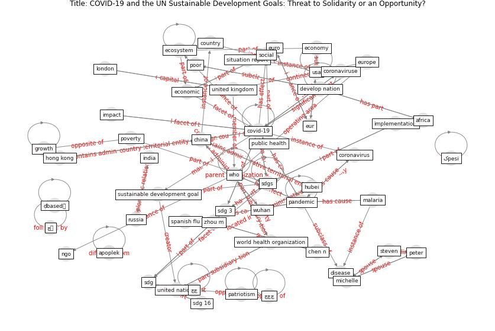

# Article: COVID-19 and the UN Sustainable Development Goals: Threat to Solidarity or an Opportunity? (leal_filho_covid-19_2020)

* Source: [10.3390/su12135343](https://doi.org/10.3390/su12135343)
* Year: 2020
* Cluster: [health-pandemic](cluster_4)

## Keywords

 * [africa](keyword_africa), airline, ankara, apoplek, asia, [business](keyword_business), cent, chen n, [china](keyword_china), [clean](keyword_clean), [climate change](keyword_climate_change), [coronavirus](keyword_coronavirus), coronaviruse, [country](keyword_country), [covid 19 pandemic](keyword_covid_19_pandemic), [covid-19](keyword_covid-19), delegate, develop economy, [develop nation](keyword_develop_nation), [disease](keyword_disease), [economic](keyword_economic), economic growth, [economy](keyword_economy), ecosystem, eur, [euro](keyword_euro), [europe](keyword_europe), [finland](keyword_finland), growth, [health](keyword_health), [health system](keyword_health_system), [healthcare](keyword_healthcare), [hong kong](keyword_hong_kong), how can we save life and the economy, [hubei](keyword_hubei), ilo, [impact](keyword_impact), implementation, [india](keyword_india), international, international labour organiztion, international travel, j j clean, local transmission, [lockdown](keyword_lockdown), [london](keyword_london), malaria, [mental health](keyword_mental_health), michelle, nana addo dankwa akufo addo, ngo, [outbreak](keyword_outbreak), oxfam, [pandemic](keyword_pandemic), patriotism, peter, pneumonia, poor, poverty, [public health](keyword_public_health), republicof ghana, respir, [russia](keyword_russia), [sdg](keyword_sdg), sdg 16, sdg 3, [sdgs](keyword_sdgs), shi, situation report, [social](keyword_social), spanish flu, steven, struct, suffer, [sustainable development goal](keyword_sustainable_development_goal), [system](keyword_system), system theoretic, [taiwan](keyword_taiwan), thomson reuters foundation trust, tieleman, trustee, turkey, unctad, [unesco](keyword_unesco), [united kingdom](keyword_united_kingdom), [united nations](keyword_united_nations), usa, who, [world](keyword_world), world bank group, world health organization, [wuhan](keyword_wuhan), zhou m, چچ, چچچ, چچچچچ, چک, چہ, کpesi, ḍbased製

## Concepts

 

## Neighbours

### Closest articles

* The COVID-19 pandemic: Lessons on building more equal and sustainable societies - [LINK](article_van_barneveld_covid-19_2020)
* COVID-19: IMPACT OF THE PANDEMIC ON THE SUSTAINABLE DEVELOPMENT GOALS - [LINK](article_samout_covid-19_2020)
* Health, Economic and Social Development Challenges of the COVID-19 Pandemic: Strategies for Multiple and Interconnected Issues - [LINK](article_panneer_health_2022)
* How COVID-19 Redefines the Concept of Sustainability - [LINK](article_hakovirta_how_2020)
* Building up an ecologically sustainable and socially desirable post-COVID-19 future - [LINK](article_duflot_building_2021)
* Urban planning after COVID-19 - [LINK](article_rtpi_urban_2021)
* A critical analysis of the impacts of COVID-19 on the global economy and ecosystems and opportunities for circular economy strategies - [LINK](article_ibn-mohammed_critical_2021)
* The socio-economic implications of the coronavirus pandemic (COVID-19): A review - [LINK](article_nicola_socio-economic_2020)
* Mapping research in logistics and supply chain management during COVID-19 pandemic - [LINK](article_montoya-torres_mapping_2021)
* Global value chains: Efficiency and risks in the context of COVID-19 - [LINK](article_oecd_global_2021)

### Closest BPs

* Blueprint: Air Cleaning Plants - [LINK](bp_15)
* Blueprint: Architecture design - [LINK](bp_2)
* Blueprint: Tender support at building stage - [LINK](bp_9)
