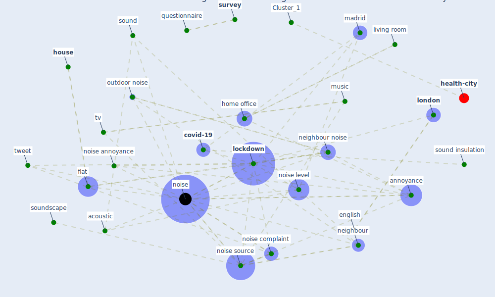

# Article: Attitudes towards outdoor and neighbour noise during the COVID-19 lockdown: A case study in London (lee_attitudes_2021)

* Source: [10.1016/j.scs.2021.102768](https://doi.org/10.1016/j.scs.2021.102768)
* Year: 2021
* Cluster: [air-sars](cluster_9)

## Keywords

 * acoustic, acoustic comfort, acoustic environment, [airborne](keyword_airborne), airborne source, alsafi, animal, [annoyance](keyword_annoyance), annoyance rating, apply acoustic, [barcelona](keyword_barcelona), basu b murphy e molt a basu a, before the lockdown, bird, [brazil](keyword_brazil), [build](keyword_build), category, [construction](keyword_construction), [coronavirus](keyword_coronavirus), coronavirus disease, coun try, [covid 19 pandemic](keyword_covid_19_pandemic), [covid-19](keyword_covid-19), [datum](keyword_datum), english, error bar, f langdon, female, film, flat, general, gjestland, go ransson, guo, home office, [house](keyword_house), j jeon j kang j, [japan](keyword_japan), k ghani, kerwan, living room, [lockdown](keyword_lockdown), lockdown measure, [london](keyword_london), looove, love, luca, machine learning, machinery, madrid, major road, male, manually, minor road, movement of people, music, [nature](keyword_nature), neigh bour noise, neighbour, [neighbour noise](keyword_neighbour_noise), neighbour noise complaint, [noise](keyword_noise), noise annoyance, noise complaint, noise level, [noise source](keyword_noise_source), outdoor, outdoor noise, outdoor noise complaint, [pandemic](keyword_pandemic), perception, press, previous study, questionnaire, road traffic, [sound](keyword_sound), sound insulation, soundscape, stan dard error, stockholm, structureborne, [survey](keyword_survey), [sustainability](keyword_sustainability), sustainable city, [sweden](keyword_sweden), t test, talk, talk shout, train, tram, trans portation, [transport](keyword_transport), transportation, transportation noise, transportation research part d, tv, tweet, [united kingdom](keyword_united_kingdom), urban area, [window](keyword_window)

## Concepts

 

## Neighbours

### Closest articles

* The City Under COVID‐19: Podcasting As Digital Methodology - [LINK](article_rogers_city_2020)
* Assessing the health and hygiene performance of apartment buildings - [LINK](article_ho_assessing_2004)
* Reframe how to serve your community in the midst of a pandemic - [LINK](article_sutton_reframe_2020)
* Assessment of COVID-19 precautionary measures in sports facilities: A case study on a health club in Saudi Arabia - [LINK](article_ibrahim_assessment_2022)
* How Covid-19 Has Permanently Changed the Fitness Industry - [LINK](article_davalos_how_2021)
* 10 Adaptive Measures for Public Places to face the COVID 19 Pandemic Outbreak - [LINK](article_cheshmehzangi_10_2020)
* COVID-19 Bulletin 1: Alterations to BREEAM assessment requirements as a result of the Coronavirus pandemic – Knowledge Base - [LINK](article_breeam_covid-19_2020)
* Urban Community Sustainable Development Patterns under the Influence of COVID-19: A Case Study Based on the Non-Contact Interaction Perspective of Hangzhou City - [LINK](article_wang_urban_2021)
* A Platform for Citizen Cooperation during the COVID-19 Pandemic in RN, Brazil - [LINK](article_de_araujo_platform_2020)
* Housing Experience in Gated Communities in the Time of Pandemics: Lessons Learned from COVID-19 - [LINK](article_asfour_housing_2022)

### Closest BPs

* Blueprint: Resilience in staffing and skills training - [LINK](bp_12)
* Blueprint: Tracking and enforcing use of Personal Protective Equipment - [LINK](bp_23)
* Blueprint: Public places as information points - [LINK](bp_8)
