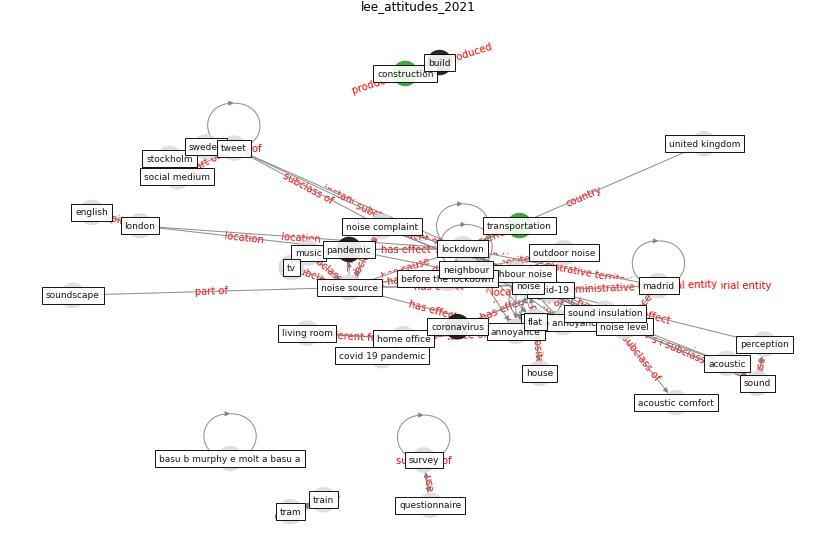

# Article: __Attitudes towards outdoor and neighbour noise during the COVID-19 lockdown: A case study in London__ (lee_attitudes_2021)

* [10.1016/j.scs.2021.102768](https://doi.org/10.1016/j.scs.2021.102768)
* Cluster: [health-building](cluster_9)

## Keywords

* [noise](keyword_noise), [lockdown](keyword_lockdown), [noise source](keyword_noise_source), [neighbour noise](keyword_neighbour_noise), [annoyance](keyword_annoyance), [noise level](keyword_noise_level), [home office](keyword_home_office), [london](keyword_london), outdoor noise, [house](keyword_house), [flat](keyword_flat), noise complaint, [covid-19](keyword_covid-19), living room, [madrid](keyword_madrid)

## Keywords at large

* [lockdown](keyword_lockdown), [noise](keyword_noise), [noise source](keyword_noise_source), [neighbour noise](keyword_neighbour_noise), [annoyance](keyword_annoyance), [noise level](keyword_noise_level), [madrid](keyword_madrid), [home office](keyword_home_office), [london](keyword_london), [flat](keyword_flat)

## Concepts

 

### Closest articles 

* [The City Under COVID‐19: Podcasting As Digital Methodology](article_rogers_city_2020)
* [Study of COVID-19 pandemic in London (UK) from urban context](article_ghosh_study_2020)
* [Association of built environment attributes with the spread of COVID-19 at its initial stage in China](article_li_association_2021)
* [Refleksioner fra en pandemi](article_realdania_refleksioner_2022)
* [Pandemiens arkitektur](article_realdania_pandemiens_2022)
* [Climate and the spread of COVID-19](article_chen_climate_2021)
* [Open-source analytics tools for studying the COVID-19 coronavirus outbreak](article_wu_open-source_2020)
* [10 Adaptive Measures for Public Places to face the COVID 19 Pandemic Outbreak](article_cheshmehzangi_10_2020)
* [The Socio-Spatial Determinants of COVID-19 Diffusion: The Impact of Globalisation, Settlement Characteristics and Population](article_sigler_socio-spatial_2020)
* [The effect of human mobility and control measures on the COVID-19 epidemic in China](article_kraemer_effect_2020)

### References 

* [The socio-economic implications of the coronavirus
pandemic (COVID-19): A review](article_nicola_socio-economic_2020)

### Cited by 

