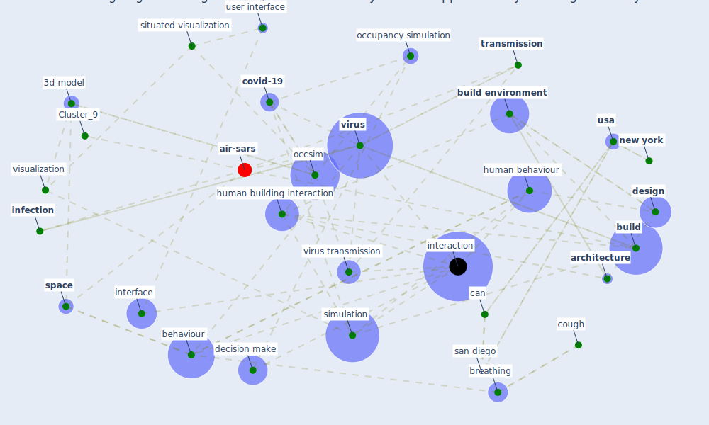

# Article: Designing a Multi-Agent Occupant Simulation System to Support Facility Planning and Analysis for COVID-19 (lee_designing_2021)

* Source: [10.1145/3461778.3462030](https://doi.org/10.1145/3461778.3462030)
* Year: 2021
* Cluster: [building-design](cluster_5)

## Keywords

 * 3d, 3d building, 3d building model, 3d model, acm, alex tessi, [architect](keyword_architect), [architecture](keyword_architecture), azam khan, behaviour, behaviour state, bokyung lee, breathing, [build](keyword_build), [build environment](keyword_build_environment), c1, c2, [california](keyword_california), can, [canada](keyword_canada), carlo ratti, [china](keyword_china), [computer](keyword_computer), [construction](keyword_construction), contagion, [contamination](keyword_contamination), contexts, cough, [covid 19 pandemic](keyword_covid_19_pandemic), [covid-19](keyword_covid-19), danil nagy, [datum](keyword_datum), davide schaumann, decision make, decision make process, [design](keyword_design), design evaluation, design intent, designer, [environment](keyword_environment), epidemiologist, erin morrow, facility planning, furniture, hailemariam, ham s alavi, hbi, hci, health expert, human behaviour, human building interaction, [industry](keyword_industry), [infection](keyword_infection), infectivity, [influenza](keyword_influenza), [interaction](keyword_interaction), [interface](keyword_interface), interior, jakub krukar, meeting room, [model](keyword_model), [new york](keyword_new_york), [occsim](keyword_occsim), occupancy simulation, [occupant](keyword_occupant), [outbreak](keyword_outbreak), [pandemic](keyword_pandemic), [pathogen](keyword_pathogen), [personalization](keyword_personalization), [perspective](keyword_perspective), pharmacy, [plan](keyword_plan), process, [prototype](keyword_prototype), [public health](keyword_public_health), rubaiat habib kazi, ruth dalton, san diego, simona d oca, simulate, [simulation](keyword_simulation), situated visualization, sneeze, [space](keyword_space), space configuration, spatial, [spread](keyword_spread), [surface](keyword_surface), temporal, [transmission](keyword_transmission), trust, [usa](keyword_usa), usability, user interface, video game, virion, [virus](keyword_virus), virus transmission, [visualization](keyword_visualization), xuan luo

## Concepts

 

## Neighbours

### Closest articles

* The COVID-19 Impact on Flexible Office Space - [LINK](article_clifton_covid-19_2020)
* Health, Wellbeing \& Productivity in Offices - [LINK](article_world_green_building_council_health_2014)
* An environmental and health perspective for COVID-19 outbreak: Meteorology and air quality influence, sewage epidemiology indicator, hospitals disinfection, drug therapies and recommendations - [LINK](article_barcelo_environmental_2020)
* How the Coronavirus Will Reshape Architecture - [LINK](article_chayka_how_2020)
* COVID-19 Experience Transforming the Protective Environment of Office Buildings and Spaces - [LINK](article_phapant_covid-19_2021)
* Occupant health in buildings: Impact of the COVID-19 pandemic on the opinions of building professionals and implications on research - [LINK](article_awada_occupant_2022)
* Architectural Design Drives the Biogeography of Indoor Bacterial Communities - [LINK](article_kembel_architectural_2014)
* Computational analysis of SARS-CoV-2/COVID-19 surveillance by wastewater-based epidemiology locally and globally: Feasibility, economy, opportunities and challenges - [LINK](article_hart_computational_2020)

### Closest BPs

* Blueprint: Monitoring of wastewater - [LINK](bp_21)
* Blueprint: Air Cleaning Plants - [LINK](bp_15)
* Blueprint: Indoor Environmental Quality (IEQ) monitoring system - [LINK](bp_3)
