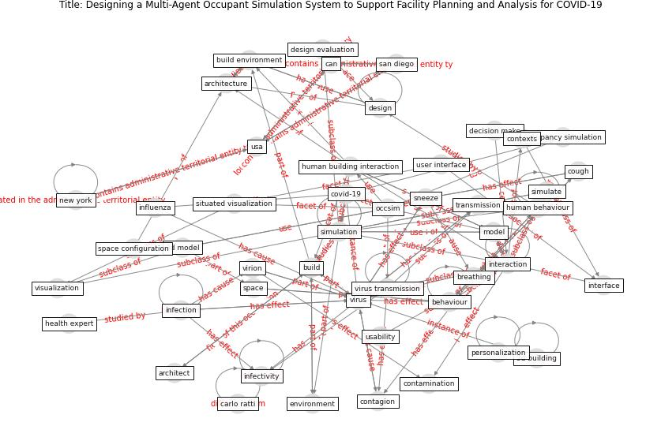

# Article: __Designing a Multi-Agent Occupant Simulation System to Support Facility Planning and Analysis for COVID-19__ (lee_designing_2021)

* [10.1145/3461778.3462030](https://doi.org/10.1145/3461778.3462030)
* Cluster: [building-space](cluster_7.md)

## Keywords

[simulation](keyword_simulation.md), [virus](keyword_virus.md), [build](keyword_build.md), [behaviour](keyword_behaviour.md), [design](keyword_design.md), [transmission](keyword_transmission.md), [visualization](keyword_visualization.md)

## Concepts

 

