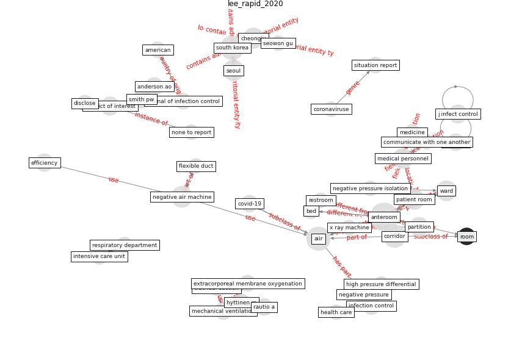

# Article: __Rapid expansion of temporary, reliable airborne-infection isolation rooms with negative air machines for critical COVID-19 patients__ (lee_rapid_2020)

* [10.1016/j.ajic.2020.04.022](https://doi.org/10.1016/j.ajic.2020.04.022)
* Cluster: [air-sars](cluster_0)

## Keywords

* [anteroom](keyword_anteroom), [aiir](keyword_aiir), [south korea](keyword_south_korea), [corridor](keyword_corridor), [negative air machine](keyword_negative_air_machine), [cheongju](keyword_cheongju), [seoul](keyword_seoul), [patient room](keyword_patient_room), ward, [medical personnel](keyword_medical_personnel), partition, [conflict of interest](keyword_conflict_of_interest), negative pressure, anderson ao, [efficiency](keyword_efficiency)

## Keywords at large

* [anteroom](keyword_anteroom), [south korea](keyword_south_korea), [aiir](keyword_aiir), [corridor](keyword_corridor), [negative air machine](keyword_negative_air_machine), [seoul](keyword_seoul), [cheongju](keyword_cheongju), [patient room](keyword_patient_room), [medical personnel](keyword_medical_personnel)

## Concepts

 

### Closest articles 

* [COVID-19 Forced Hospitals to Build Negative
Pressure Rooms Fast](article_dyer_covid-19_2020)
* [Real-world data show that filters clean COVID-causing virus from air](article_thompson_real-world_2021)
* [SARS-CoV-2 RNA detection of hospital isolation wards hygiene monitoring during the Coronavirus Disease 2019 outbreak in a Chinese hospital](article_wang_sars-cov-2_2020)
* [onway-morris_removal_2021](article_onway-morris_removal_2021)
* [Aerosol and Surface Distribution of Severe Acute Respiratory Syndrome Coronavirus 2 in Hospital Wards, Wuhan, China, 2020](article_guo_aerosol_2020)
* [Air, Surface Environmental, and Personal Protective Equipment Contamination by Severe Acute Respiratory Syndrome Coronavirus 2 (SARS-CoV-2) From a Symptomatic Patient](article_ong_air_2020)
* [Upper-room ultraviolet air disinfection might help to reduce COVID-19 transmission in buildings: a feasibility study](article_beggs_upper-room_2020)
* [Upper-Room Ultraviolet Light and Negative Air Ionization to Prevent Tuberculosis Transmission](article_escombe_upper-room_2009)
* [Effect of Ultraviolet Germicidal Irradiation on Viral Aerosols](article_walker_effect_2007)
* [Far-UVC light (222 nm) efficiently and safely inactivates airborne human coronaviruses](article_buonanno_far-uvc_2020)

