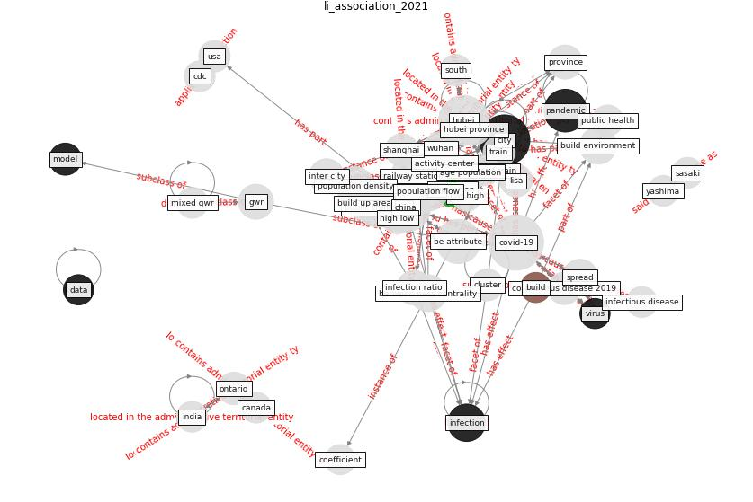

# Article: __Association of built environment attributes with the spread of COVID-19 at its initial stage in China__ (li_association_2021)

* [10.1016/j.scs.2021.102752](https://doi.org/10.1016/j.scs.2021.102752)
* Cluster: [health-city](cluster_3)

## Keywords

[city](keyword_city), [pandemic](keyword_pandemic), [infection](keyword_infection), [population](keyword_population)

## Concepts

 

### References 

* [2019 Novel Coronavirus (COVID-19) Pandemic:
Built Environment Considerations To Reduce
Transmission](article_dietz_2019_2020)
* [COVID-19 Could Leverage a Sustainable Built
Environment](article_pinheiro_covid-19_2020)

### Cited by 

* [Prophylactic Architecture: Formulating the Concept
of Pandemic-Resilient Homes](article_elrayies_prophylactic_2022)
* [Treating two pandemics for the price of one: Chronic and
infectious disease impacts of the built and natural
environment](article_frank_treating_2021)
