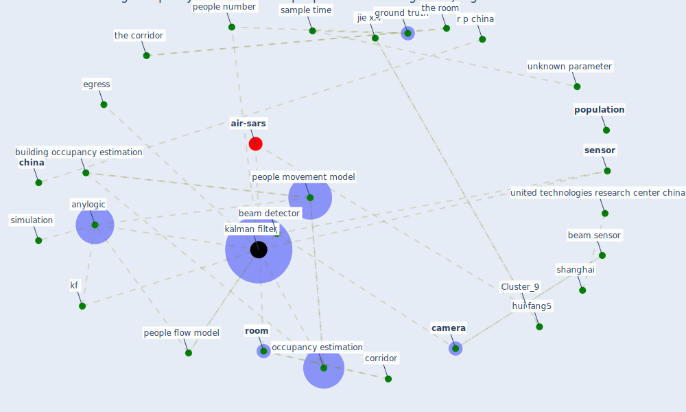

# Article: Building occupancy estimation with people flow modeling in AnyLogic (li_building_2016)

* Source: [10.1109/ICCA.2016.7505355](https://doi.org/10.1109/ICCA.2016.7505355)
* Year: 2016
* Cluster: [building-design](cluster_5)

## Keywords

 * [anylogic](keyword_anylogic), beam, beam detector, beam sensor, behavior, [build](keyword_build), build layout, [building](keyword_building), building model, building occupancy estimation, building operation, [camera](keyword_camera), [china](keyword_china), complexity of people behavior, congestion, construct building model, [corridor](keyword_corridor), distribution, dynamic people flow model, efficiency, egress, egress management, egress simulation, embed people behavior model, estimate people number, estimation, evacuation, glasgow, ground truth, high rise, high rise building, histogram, hui fang5, jie xi4, [kalman filter](keyword_kalman_filter), kathmandu, kf, kf method method, kf result, kinetic people movement model, linear system, logic diagram, matlab, mean square error, measure people, measurement, measurement distribution, measurement uncertainty, measurement vector, model identification problem, model people number, mse, nepal, [number](keyword_number), occupancy estimation, optimization, [parameter](keyword_parameter), people movement model, people number, people occupancy estimation, people simulation, people flow, people flow estimation, people flow model, [population](keyword_population), probability distribution, r l in and a banaszuk video base estimation of build occupancy during emergency egress american control conference 2008 894 901, r p china, [room](keyword_room), sample time, scotland, second moment, [sensor](keyword_sensor), sensor model, [shanghai](keyword_shanghai), [simulation](keyword_simulation), simulation platform, simulation software, simulation test, site experiment, software, state vector, the corridor, the room, united technologies research center, united technologies research center china, unknown parameter, urc china office, urc utc, utrc, utrc china, v1 t, video camera, x1 t, α1, α1 x2 t w3 t 1 5 x4 t 1, α3 x6 t, αi, first, flow fig

## Concepts

 

## Neighbours

### Closest articles

* EXPOSED: An occupant exposure model for confined spaces to retrofit crowd models during a pandemic - [LINK](article_ronchi_exposed_2020)
* COVID-ABS: An agent-based model of COVID-19 epidemic to simulate health and economic effects of social distancing interventions - [LINK](article_silva_covid-abs_2020)
* Digital Twin of COVID-19 Mass Vaccination Centers - [LINK](article_pilati_digital_2021)
* Social distancing enhanced automated optimal design of physical spaces in the wake of the COVID-19 pandemic - [LINK](article_ugail_social_2021)
* COVID19-Routes: A Safe Pedestrian Navigation Service - [LINK](article_cantarero_covid19-routes_2021)
* Mitigation strategies and compliance in the COVID-19 fight; how much compliance is enough? - [LINK](article_mukerjee_mitigation_2021)
* Exploring the Non-Medical impacts of Covid-19 using Natural Language Processing - [LINK](article_agade_exploring_2020)
* Assessment of COVID-19 precautionary measures in sports facilities: A case study on a health club in Saudi Arabia - [LINK](article_ibrahim_assessment_2022)
* The Intelligent Lockdown: Compliance with COVID-19 Mitigation Measures in the Netherlands - [LINK](article_kuiper_intelligent_2020)
* Compliance with COVID-19 Mitigation Measures in the United States - [LINK](article_van_rooij_compliance_2020)

### Closest BPs

* Blueprint: Resilience in staffing and skills training - [LINK](bp_12)
* Blueprint: Installing high-efficiency air filters - [LINK](bp_11)
* Blueprint: Air Cleaning Plants - [LINK](bp_15)
