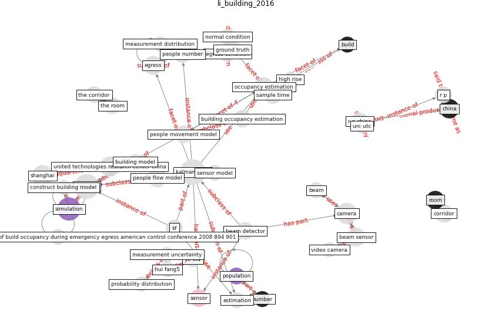

# Article: __Building occupancy estimation with people flow modeling in AnyLogic__ (li_building_2016)

* [10.1109/ICCA.2016.7505355](https://doi.org/10.1109/ICCA.2016.7505355)
* Cluster: [health-building](cluster_9)

## Keywords

* [kalman filter](keyword_kalman_filter), [anylogic](keyword_anylogic), [shanghai](keyword_shanghai), [simulation](keyword_simulation), [camera](keyword_camera), [united technologies research center china](keyword_united_technologies_research_center_china), [occupancy estimation](keyword_occupancy_estimation), [people flow model](keyword_people_flow_model), [beam sensor](keyword_beam_sensor), [corridor](keyword_corridor), [room](keyword_room), sample time, [sensor](keyword_sensor), ground truth, r p china

## Keywords at large

* [kalman filter](keyword_kalman_filter), [anylogic](keyword_anylogic), [simulation](keyword_simulation), [shanghai](keyword_shanghai), [camera](keyword_camera), [united technologies research center china](keyword_united_technologies_research_center_china), [occupancy estimation](keyword_occupancy_estimation), [egress](keyword_egress), [people flow model](keyword_people_flow_model), [beam sensor](keyword_beam_sensor)

## Concepts

 

### Closest articles 

* [EXPOSED: An occupant exposure model for confined spaces to retrofit crowd models during a pandemic](article_ronchi_exposed_2020)
* [COVID-ABS: An agent-based model of COVID-19 epidemic to simulate health and economic effects of social distancing interventions](article_silva_covid-abs_2020)
* [COVID19-Routes: A Safe Pedestrian Navigation Service](article_cantarero_covid19-routes_2021)
* [Social distancing enhanced automated optimal design of physical spaces in the wake of the COVID-19 pandemic](article_ugail_social_2021)
* [Digital Twin of COVID-19 Mass Vaccination Centers](article_pilati_digital_2021)
* [Exploring the Non-Medical impacts of Covid-19 using Natural Language Processing](article_agade_exploring_2020)
* [Assessment of COVID-19 precautionary measures in sports facilities: A case study on a health club in Saudi Arabia](article_ibrahim_assessment_2022)
* [How will COVID-19 change future building regulations?](article_hmc_architects_how_2020)
* [DeepSOCIAL: Social Distancing Monitoring and Infection Risk Assessment in COVID-19 Pandemic](article_rezaei_deepsocial_2020)
* [Will a pandemic change building codes?](article_rozgus_will_2020)

