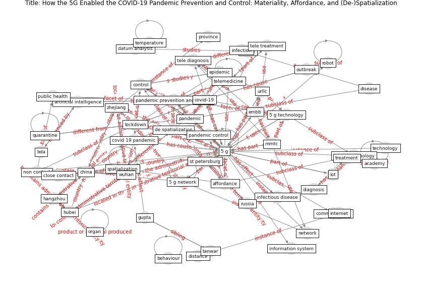

# Article: __How the 5G Enabled the COVID-19 Pandemic Prevention and Control: Materiality, Affordance, and (De-)Spatialization__ (li_how_2022)

* [10.3390/ijerph19158965](https://doi.org/10.3390/ijerph19158965)
* Cluster: [blockchain-ai](cluster_11)

## Keywords

* [5 g](keyword_5_g), [5g](keyword_5g), [de spatialization](keyword_de_spatialization), [covid-19](keyword_covid-19), [pandemic prevention and control](keyword_pandemic_prevention_and_control), [pandemic](keyword_pandemic), [5 g network](keyword_5_g_network), [spatialization](keyword_spatialization), [control](keyword_control), [pandemic control](keyword_pandemic_control), [china](keyword_china), [wuhan](keyword_wuhan), embb, [telemedicine](keyword_telemedicine), [lockdown](keyword_lockdown)

## Keywords at large

* [5 g](keyword_5_g), [5g](keyword_5g), [de spatialization](keyword_de_spatialization), [covid-19](keyword_covid-19), [pandemic prevention and control](keyword_pandemic_prevention_and_control), [5 g network](keyword_5_g_network), [spatialization](keyword_spatialization), [pandemic](keyword_pandemic), [control](keyword_control), [pandemic control](keyword_pandemic_control)

## Abstract

5G, the most disruptive innovation, had played a
significant role in the COVID-19 pandemic prevention and
control. However, as a novel technology and context, we
have little knowledge about how 5G enabled pandemic
prevention and control. This study collected 212 cases and
conducted qualitative research to explore how the 5G worked
in prevention and control. Based on the concepts of
materiality and affordance, we grounded two affordances of
spatialization and de-spatialization from the data.
Spatialization provides non-contact ways to complete the
tasks which are supposed to be completed in contact, and
de-spatialization provides remote operations to complete
the tasks which are supposed to be completed on-site.
Spatialization and de-spatialization enabled the diagnosis
and treatment of the infectors to relieve the unbalance of
medical staff, cutting the infectious route to contain the
viral spread, and logistic supply to support the prevention
and control. Our study offers theoretical contributions to
digital pandemic prevention and control, and the literature
on 5G also offers practical implications.

## Concepts

 

### Closest articles 

* [Design COVID-19 Ontology: A Healthcare and Safety Perspective](article_aloulou_design_2022)
* [Recently employed engineering techniques to reduce the spread of COVID-19 (corona virus disease 2019): a review study](article_saman_recently_2021)
* [Danish disinfection robots save lives in the fight against
the Corona virus \textbar Shaping Europe’s
digital future](article_ec_views_danish_2020)
* [Combating COVID-19—The role of robotics in managing public health and infectious diseases](article_yang_combating_2020)
* [China adapts survey drones to enforce world’s largest
quarantine](article_liu_china_2020)
* [south_china_morning_post_china_2020](article_south_china_morning_post_china_2020)
* [Drones. Disinfecting robots. Supercomputers. The
coronavirus outbreak is a test for China's tech industry
\textbar CNN Business](article_wang_drones_2020)
* [How drones help cities during the Covid-19 pandemic
\textbar TheMayor.EU](article_dimitrova_how_2021)
* [Sustainable work throughout the life course: National
policies and strategies, Publications Office of the
European Union](article_eurofund_sustainable_2016)
* [10 tech trends getting us through the COVID-19
pandemic](article_yan_10_2020)

### References 

* [The efficacy of social distance and ventilation
effectiveness in preventing COVID-19 transmission](article_sun_efficacy_2020)
* [A Comprehensive Review of the COVID-19 Pandemic
and the Role of IoT, Drones, AI, Blockchain, and
5G in Managing its Impact](article_chamola_comprehensive_2020)
* [The role of 5G for digital healthcare against COVID-19
pandemic: Opportunities and challenges](article_siriwardhana_role_2021)

### Cited by 

