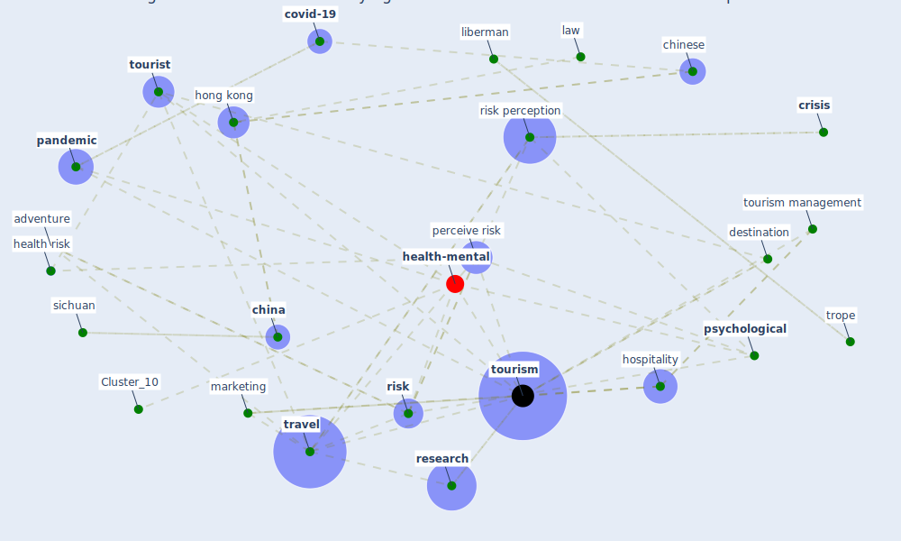

# Article: Seeing the invisible hand: Underlying effects of COVID-19 on tourists’ behavioral patterns (li_seeing_2020)

* Source: [10.1016/j.jdmm.2020.100502](https://doi.org/10.1016/j.jdmm.2020.100502)
* Year: 2020
* Cluster: [health-mental](cluster_10)

## Keywords

 * abstract construal, adventure, affect, american, [anxiety](keyword_anxiety), backpacker, [beijing](keyword_beijing), [china](keyword_china), [chinese](keyword_chinese), conservative, [coronavirus](keyword_coronavirus), [country](keyword_country), country image, covid 19 outbreak, [covid-19](keyword_covid-19), [crisis](keyword_crisis), crott, culture, de bruin, defranco, destination, destination image, disaster, disaster management, [disease](keyword_disease), disease outbreak, [distance](keyword_distance), [epidemic](keyword_epidemic), fuch, general, geng, health risk, health risk perception, [hong kong](keyword_hong_kong), hospitality, hotel, hui, illness, [image](keyword_image), [industry](keyword_industry), israel, judgment, [law](keyword_law), liberman, liu, low level construal, [management](keyword_management), [marketing](keyword_marketing), miyazaki, [news](keyword_news), oxford learner s dictionary, pacific asia, [pandemic](keyword_pandemic), past, [perceive risk](keyword_perceive_risk), perception, policymaker, probability, [psychological](keyword_psychological), psychology, recreation, [research](keyword_research), [risk](keyword_risk), [risk perception](keyword_risk_perception), risk reduction, ritchie, routledge, [safety](keyword_safety), sage, sagristano, science, self drive, [service](keyword_service), sharifpour, sichuan, so nmez, [social](keyword_social), spatial, stamolampro, state council, sun, temporal, terrorism, [tourism](keyword_tourism), tourism management, tourism marketing, tourism research, [tourist](keyword_tourist), tourist behavior, [travel](keyword_travel), travel restriction, trope, trust, uncertainty, under my backyard, [united kingdom](keyword_united_kingdom), uriely, vacation, [wuhan](keyword_wuhan), zhou

## Concepts

 

## Neighbours

### Closest articles

* Should I Stay or Should I Go? Tourists’ COVID-19 Risk Perception and Vacation Behavior Shift - [LINK](article_bratic_should_2021)
* Mobility Behaviour in View of the Impact of the COVID-19 Pandemic—Public Transport Users in Gdansk Case Study - [LINK](article_przybylowski_mobility_2021)
* Responsible Transport: A post-COVID agenda for transport policy and practice - [LINK](article_budd_responsible_2020)
* Pandemiens arkitektur - [LINK](article_realdania_pandemiens_2022)
* Refleksioner fra en pandemi - [LINK](article_realdania_refleksioner_2022)
* Emerging from Lockdown: CIBSE COVID-19 Guidance - [LINK](article_cibse_emerging_2020)
* Strengthening resilience: a priority shared by Health 2020 and - [LINK](article_who_strengthening_2017)
* Touchless Retail: What the Rest of the World could learn from China’s new ways to shop - [LINK](article_capgemini_touchless_2020)
* Retail Signage During the COVID-19 Pandemic - [LINK](article_mcneish_retail_2020)

### Closest BPs

* Blueprint: Smart Locker System - [LINK](bp_1)
* Blueprint: Mental health – Belong: Do something with someone - [LINK](bp_19)
* Blueprint: Mental health – Commit: Do something meaningfull - [LINK](bp_20)
