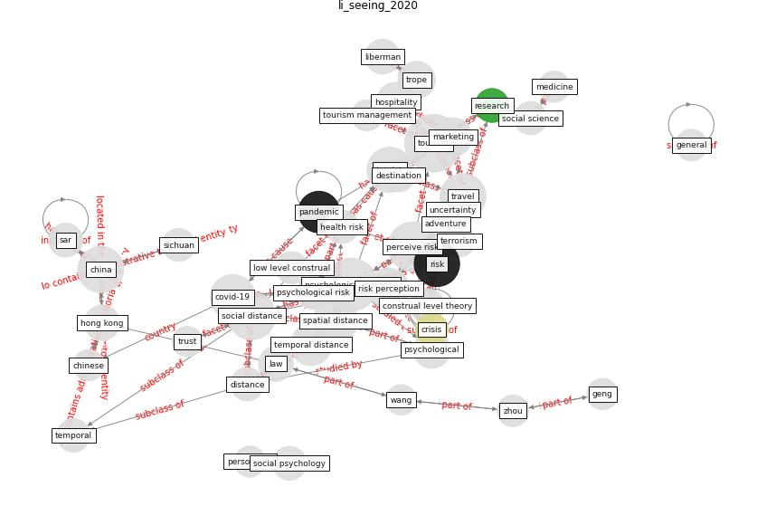

# Article: __Seeing the invisible hand: Underlying effects of COVID-19 on tourists’ behavioral patterns__ (li_seeing_2020)

* [10.1016/j.jdmm.2020.100502](https://doi.org/10.1016/j.jdmm.2020.100502)
* Cluster: [tourism-tourist](cluster_7)

## Keywords

* [tourism](keyword_tourism), [psychological distance](keyword_psychological_distance), [perceive risk](keyword_perceive_risk), [social distance](keyword_social_distance), [travel](keyword_travel), [risk](keyword_risk), [tourist](keyword_tourist), [china](keyword_china), [spatial distance](keyword_spatial_distance), [covid-19](keyword_covid-19), temporal distance, [risk perception](keyword_risk_perception), [pandemic](keyword_pandemic), hospitality, [marketing](keyword_marketing)

## Keywords at large

* [tourism](keyword_tourism), [psychological distance](keyword_psychological_distance), [perceive risk](keyword_perceive_risk), [social distance](keyword_social_distance), [travel](keyword_travel), [risk](keyword_risk), [china](keyword_china), [tourist](keyword_tourist), [spatial distance](keyword_spatial_distance), [covid-19](keyword_covid-19)

## Concepts

 

### Closest articles 

* [Should I Stay or Should I Go? Tourists’ COVID-19 Risk Perception and Vacation Behavior Shift](article_bratic_should_2021)
* [Air pollution linked with higher COVID-19 death rates](article_harvard_th_chan_schoold_of_public_health_air_2020)
* [COVID-19 Higher Mortality in Chinese Regions With Chronic Exposure to Lower Air Quality](article_pansini_covid-19_2021)
* [Compliance with COVID-19 Mitigation Measures in the United States](article_van_rooij_compliance_2020)
* [The Intelligent Lockdown: Compliance with COVID-19 Mitigation Measures in the Netherlands](article_kuiper_intelligent_2020)
* [Mitigation strategies and compliance in the COVID-19 fight; how much compliance is enough?](article_mukerjee_mitigation_2021)
* [The changes in the effects of social media use of Cypriots due to COVID-19 pandemic](article_kaya_changes_2020)
* [COVID-19 misinformation: Accuracy of articles about coronavirus prevention mostly shared on social media](article_obiala_covid-19_2021)
* [What drives unverified information sharing and cyberchondria during the COVID-19 pandemic?](article_laato_what_2020)
* [How COVID-19 Could Accelerate the Adoption of New Retail Technologies and Enhance the (E-)Servicescape](article_willems_how_2021)

