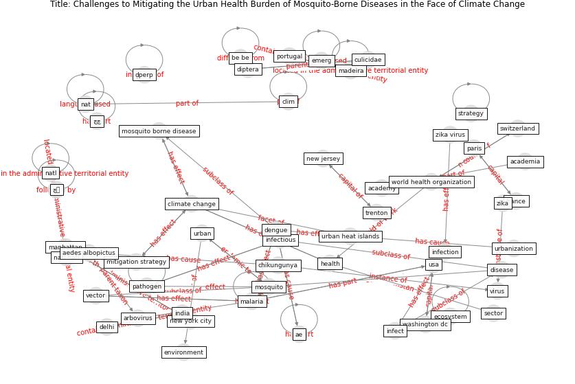

# Article: Challenges to Mitigating the Urban Health Burden of Mosquito-Borne Diseases in the Face of Climate Change (ligsay_challenges_2021)

* Source: [10.3390/ijerph18095035](https://doi.org/10.3390/ijerph18095035)
* Year: 2021
* Cluster: [urban-city](cluster_13)

## Keywords

 * academia, [academy](keyword_academy), acta trop, ae, aede, aedes albopictus, aedes japonicus, aedes vittatus, aegypti, aeon, [africa](keyword_africa), amann m, anopheles stephensi, arbovirus, ayeb karlsson s, be be, bull, cell biol, chikungunya, [city](keyword_city), clim, [climate change](keyword_climate_change), commun, culicidae, delhi, [dengue](keyword_dengue), dengue virus, denv, diptera, [disease](keyword_disease), [ecosystem](keyword_ecosystem), emerg, [environment](keyword_environment), [epidemiology](keyword_epidemiology), evidence for a significant urbanization effect on climate in china, [france](keyword_france), gjenero margan, habitat, [health](keyword_health), heat, huhn g d, [india](keyword_india), infect, [infection](keyword_infection), infectious, [infectious disease](keyword_infectious_disease), insecticide, institut pasteur, kuala lumpur, la ruche, madeira, [malaria](keyword_malaria), [manhattan](keyword_manhattan), mitigation strategy, montarsi f, [mosquito](keyword_mosquito), mosquito borne disease, mosquito control, mosquito vector, nat, natl, natl natl, [new jersey](keyword_new_jersey), [new york city](keyword_new_york_city), non infectious, pacific, parasit, paris, [pathogen](keyword_pathogen), [portugal](keyword_portugal), [public health](keyword_public_health), [risk](keyword_risk), [sector](keyword_sector), shade, singapore, souarès, strategy, [switzerland](keyword_switzerland), systematic review, topics zika en, [trenton](keyword_trenton), tropic, [urban](keyword_urban), urban geometry, urban health inequities and the added pressure ofclimate change, urban heat islands, urbanization, [usa](keyword_usa), [vector](keyword_vector), [virus](keyword_virus), [washington dc](keyword_washington_dc), [water](keyword_water), who, [world health organization](keyword_world_health_organization), [zika](keyword_zika), zika virus, zoonotic dis, چچ, [چہ](keyword_چہ), ḍperp

## Concepts

 

## Neighbours

### Closest articles

* Vector-borne disease, climate change and urban design - [LINK](article_ogden_vector-borne_2016)
* Global policy challenges for urban vector-borne disease risks - [LINK](article_alabaster_global_2016)
* Making green infrastructure healthier infrastructure - [LINK](article_lohmus_making_2015)
* The impact of climate change on the epidemiology and control of Rift Valley fever - PubMed - [LINK](article_martin_impact_2008)
* Prototype Early Warning Systems for Vector-Borne Diseases in Europe - [LINK](article_semenza_prototype_2015)
* Addressing vulnerability, building resilience: community-based adaptation to vector-borne diseases in the context of global change - [LINK](article_bardosh_addressing_2017)
* Decision Making within the Built Environment as a Strategy for Mitigating the Risk of Malaria and Other Vector-Borne Diseases - [LINK](article_obonyo_decision_2018)
* Integrating rapid risk mapping and mobile phone call record data for strategic malaria elimination planning - [LINK](article_tatem_integrating_2014)
* China adapts survey drones to enforce world’s largest quarantine - [LINK](article_liu_china_2020)

### Closest BPs

* Blueprint: Antimicrobial Surfaces - [LINK](bp_5)
* Blueprint: Smart Locker System - [LINK](bp_1)
* Blueprint: Good hand hygiene practice - [LINK](bp_16)
