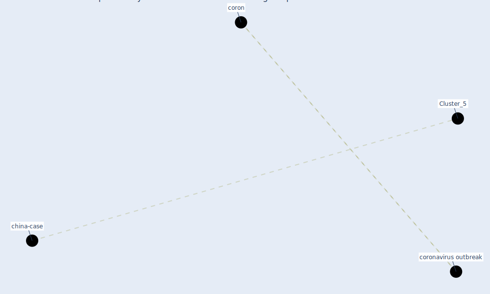

# Article: China adapts survey drones to enforce world’s largest quarantine (liu_china_2020)

* [https://www.scmp.com/business/china-business/article/3064986/china-adapts-surveying-mapping-delivery-drones-task](https://www.scmp.com/business/china-business/article/3064986/china-adapts-surveying-mapping-delivery-drones-task)
* Year: 2020
* Cluster: [surveying-drone](cluster_13)

## Keywords

 * [coron](keyword_coron), [coronavirus outbreak](keyword_coronavirus_outbreak)

## Concepts

 

## Neighbours

### Closest articles

* How is COVID-19 Experience Transforming Sustainability Requirements of Residential Buildings? A Review - [LINK](article_tokazhanov_how_2020)
*  - [LINK](article_dalessandro_covid-19_2020)
* COVID-19 as a Harbinger of Transforming Infrastructure Resilience - [LINK](article_carvalhaes_covid-19_2020)
* Preparing critical infrastructure for the future: Lessons learnt from the Covid-19 pandemic - [LINK](article_tomalska_preparing_2022)
* Prophylactic Architecture: Formulating the Concept of Pandemic-Resilient Homes - [LINK](article_elrayies_prophylactic_2022)
* COVID-19 and a new resilient infrastructure landscape - [LINK](article_oecd_covid-19_2021)
* An environmental and health perspective for COVID-19 outbreak: Meteorology and air quality influence, sewage epidemiology indicator, hospitals disinfection, drug therapies and recommendations - [LINK](article_barcelo_environmental_2020)
* COVID-19 Could Leverage a Sustainable Built Environment - [LINK](article_pinheiro_covid-19_2020)

### Closest BPs

* Blueprint: Monitoring of wastewater - [LINK](bp_21)
* Blueprint: Indoor Environmental Quality (IEQ) monitoring system - [LINK](bp_3)
* Blueprint: Air Cleaning Plants - [LINK](bp_15)
