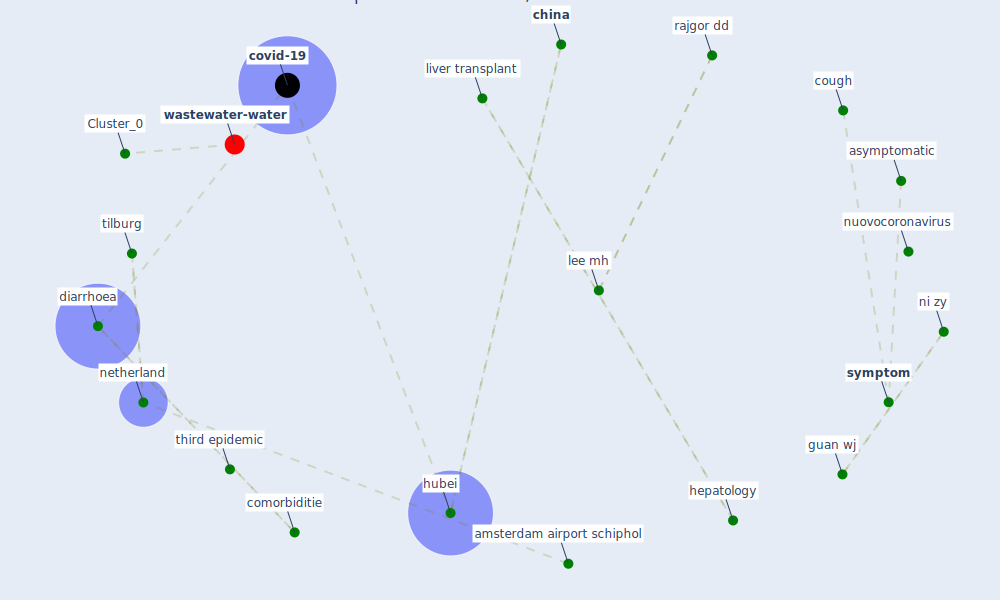

# Article: SARS-CoV-2 in wastewater: potential health risk, but also data source (lodder_sars-cov-2_2020)

* Source: [10.1016/S2468-1253(20)30087-X](https://doi.org/10.1016/S2468-1253(20)30087-X)
* Year: 2020
* Cluster: [air-sars](cluster_9)

## Keywords

 * american association, american association for the study of liver disease, amsterdam airport schiphol, [antibiotic](keyword_antibiotic), asymptomatic, buisman be, case fatality rate, case series, cern, [china](keyword_china), clinical, comorbiditie, comorbidity, compete interest, [coronavirus](keyword_coronavirus), coronaviruse, cough, covid 19 case fatality rate, [covid-19](keyword_covid-19), davide citterio, death rate, demographic, dettagliocontenuti nuovocoronavirus, [diarrhoea](keyword_diarrhoea), digestive disease, dyspnoea, enteric, faecal, [fever](keyword_fever), gastrohep, guan wj, guangdong, guangdong province, [health](keyword_health), [hepatology](keyword_hepatology), hu y, [hubei](keyword_hubei), hubei province, human waste, hygiene, hygienic, immunosuppresse, [infection](keyword_infection), [italy](keyword_italy), jiangxi, jiangxi province, konyn p, lee mh, liao x, liver disease, liver transplant, liver transplantation, lymphocyte, many estimate, munk p, [netherland](keyword_netherland), neutrophil, ni zy, njage p, no compete interest, novel coronavirus, nuovocoronavirus, observation period, p value, participate hospital, [pathogen](keyword_pathogen), pneumonia with diarrhoea, poliovirus, potentially symptomatic, pre exist, preclinical, procalcitonin, [province](keyword_province), qian s, rajgor dd, riv, roberta elisa rossi, roda husman be, rutjes sa, saab s, [sanitation](keyword_sanitation), [sar cov 2](keyword_sar_cov_2), severe acute respiratory syndrome coronavirus 2, [sewage](keyword_sewage), shenzhen, singapore, situation report, solid organ transplant, sun yat sen university, surface water, [symptom](keyword_symptom), takumi k, third epidemic, tilburg, vincenzo mazzaferro vincenzo mazzaferro, vincenzo mazzaferro vincenzo mazzaferro istitutotumori, [virus](keyword_virus), vm rivm, [wastewater](keyword_wastewater), white blood cell

## Concepts

 

## Neighbours

### Closest articles

* Wastewater surveillance for population-wide Covid-19: The present and future - [LINK](article_daughton_wastewater_2020)
* An environmental and health perspective for COVID-19 outbreak: Meteorology and air quality influence, sewage epidemiology indicator, hospitals disinfection, drug therapies and recommendations - [LINK](article_barcelo_environmental_2020)
* Computational analysis of SARS-CoV-2/COVID-19 surveillance by wastewater-based epidemiology locally and globally: Feasibility, economy, opportunities and challenges - [LINK](article_hart_computational_2020)
* When the fourth water and digital revolution encountered COVID-19 - [LINK](article_poch_when_2020)
* Future perspectives of wastewater-based epidemiology: Monitoring infectious disease spread and resistance to the community level - [LINK](article_sims_future_2020)
* Disinfection technology of hospital wastes and wastewater: Suggestions for disinfection strategy during coronavirus Disease 2019 (COVID-19) pandemic in China - [LINK](article_wang_disinfection_2020)
* Presence of SARS-Coronavirus-2 RNA in Sewage and Correlation with Reported COVID-19 Prevalence in the Early Stage of the Epidemic in The Netherlands - [LINK](article_medema_presence_2020)
* Wastewater-Based Epidemiology to monitor COVID-19 outbreak: Present and future diagnostic methods to be in your radar - [LINK](article_barcelo_wastewater-based_2020)
* First detection of SARS-CoV-2 in untreated wastewaters in Italy - [LINK](article_la_rosa_first_2020)
* SARS-CoV-2 RNA in wastewater anticipated COVID-19 occurrence in a low prevalence area - [LINK](article_randazzo_sars-cov-2_2020)

### Closest BPs

* Blueprint: Monitoring of wastewater - [LINK](bp_21)
* Blueprint: Installing UV in ductwork - [LINK](bp_10)
* Blueprint: Negative pressure rooms - [LINK](bp_13)
