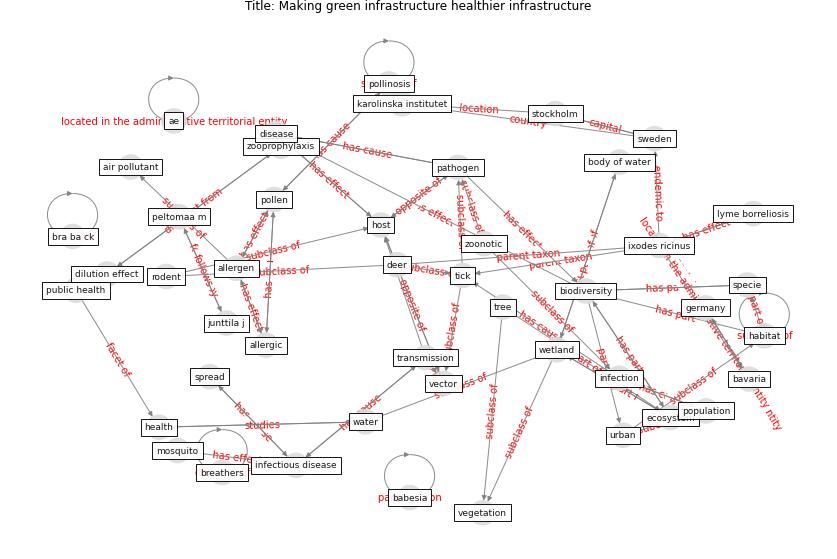

# Article: Making green infrastructure healthier infrastructure (lohmus_making_2015)

* Source: [10.3402/iee.v5.30082](https://doi.org/10.3402/iee.v5.30082)
* Year: 2015
* Cluster: [urban-city](cluster_13)

## Keywords

 * ae, aede, [air pollutant](keyword_air_pollutant), algae, allergen, [allergic](keyword_allergic), animal, asthma, [australia](keyword_australia), babesia, bartonella, bavaria, berdel d, [biodiversity](keyword_biodiversity), blood pressure, body of water, borrelia burgdorferi, bra ba ck, breathers, cecchi l, cervides, coffman rr, constructed bodies of water, [control](keyword_control), d amato g, deer, dilution effect, [disease](keyword_disease), ecological, [ecosystem](keyword_ecosystem), ecosystem service, [epidemiological](keyword_epidemiological), garcı a montijano m, [germany](keyword_germany), [green](keyword_green), green area, habitat, [health](keyword_health), health risk, heiberg a c, helsinki, hepatotoxin, host, houston, [infection](keyword_infection), [infectious disease](keyword_infectious_disease), ixodes ricinus, junttila j, karolinska institutet, koskinen k, larva, lyme borreliosis, lyme disease, [malaria](keyword_malaria), markevych i, mathey j, [mosquito](keyword_mosquito), neurotoxin, nodularin, [pathogen](keyword_pathogen), peltomaa m, [poland](keyword_poland), [pollen](keyword_pollen), pollinosis, [pollutant](keyword_pollutant), pond, [population](keyword_population), predator, pretty j, [public health](keyword_public_health), rat, rats, rink d, rodent, rosa r, side effect, solcerova a, [spain](keyword_spain), specie, [spread](keyword_spread), stockholm, [stress](keyword_stress), sugiri d, sundstro m k, [sweden](keyword_sweden), tick, toxin, trade off, [transmission](keyword_transmission), tree, triblive, [urban](keyword_urban), [vaccine](keyword_vaccine), [vector](keyword_vector), vegetation, [virus](keyword_virus), [water](keyword_water), [wetland](keyword_wetland), zoonotic, zooprophylaxis

## Concepts

 

## Neighbours

### Closest articles

* Global policy challenges for urban vector-borne disease risks - [LINK](article_alabaster_global_2016)
* Challenges to Mitigating the Urban Health Burden of Mosquito-Borne Diseases in the Face of Climate Change - [LINK](article_ligsay_challenges_2021)
* Vector-borne disease, climate change and urban design - [LINK](article_ogden_vector-borne_2016)
* The impact of climate change on the epidemiology and control of Rift Valley fever - PubMed - [LINK](article_martin_impact_2008)
* Prototype Early Warning Systems for Vector-Borne Diseases in Europe - [LINK](article_semenza_prototype_2015)
* Addressing vulnerability, building resilience: community-based adaptation to vector-borne diseases in the context of global change - [LINK](article_bardosh_addressing_2017)
* Decision Making within the Built Environment as a Strategy for Mitigating the Risk of Malaria and Other Vector-Borne Diseases - [LINK](article_obonyo_decision_2018)
* Integrating rapid risk mapping and mobile phone call record data for strategic malaria elimination planning - [LINK](article_tatem_integrating_2014)
* A Continuously Active Antimicrobial Coating effective against Human Coronavirus 229E - [LINK](article_ikner_continuously_2020)
* A Surface Coating that Rapidly Inactivates SARS-CoV-2 - [LINK](article_behzadinasab_surface_2020)

### Closest BPs

* Blueprint: Antimicrobial Surfaces - [LINK](bp_5)
* Blueprint: Smart Locker System - [LINK](bp_1)
* Blueprint: Good hand hygiene practice - [LINK](bp_16)
