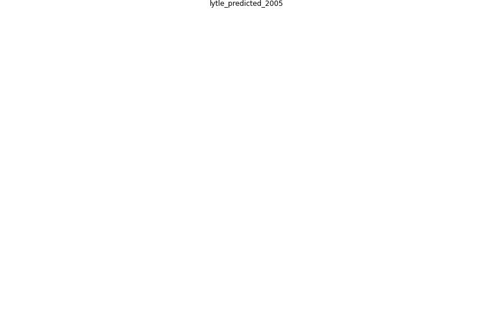

# Article: __Predicted Inactivation of Viruses of Relevance to Biodefense by Solar Radiation__ (lytle_predicted_2005)

* [10.1128/JVI.79.22.14244-14252.2005](https://doi.org/10.1128/JVI.79.22.14244-14252.2005)

## Keywords

## Abstract

ABSTRACT

UV radiation from the sun is the primary germicide in the
environment. The goal of this study was to estimate
inactivation of viruses by solar exposure. We reviewed
published reports on 254-nm UV inactivation and tabulated
the sensitivities of a wide variety of viruses, including
those with double-stranded DNA, single-stranded DNA,
double-stranded RNA, or single-stranded RNA genomes. We
calculated D 37 values (fluence producing on average one
lethal hit per virion and reducing viable virus to 37\%)
from all available data. We defined “size-normalized
sensitivity” (SnS) by multiplying UV 254 sensitivities (
D 37 values) by the genome size, and SnS values were
relatively constant for viruses with similar genetic
composition. In addition, SnS values were similar for
complete virions and their defective particles, even when
the corresponding D 37 values were significantly different.
We used SnS to estimate the UV 254 sensitivities of viruses
for which the genome composition and size were known but no
UV inactivation data were available, including smallpox
virus, Ebola, Marburg, Crimean-Congo, Junin, and other
hemorrhagic viruses, and Venezuelan equine encephalitis and
other encephalitis viruses. We compiled available data on
virus inactivation as a function of wavelength and
calculated a composite action spectrum that allowed
extrapolation from the 254-nm data to solar UV. We combined
our estimates of virus sensitivity with solar measurements
at different geographical locations to predict virus
inactivation. Our predictions agreed with the available
experimental data. This work should be a useful step to
understanding and eventually predicting the survival of
viruses after their release in the environment.

## Concepts

 

