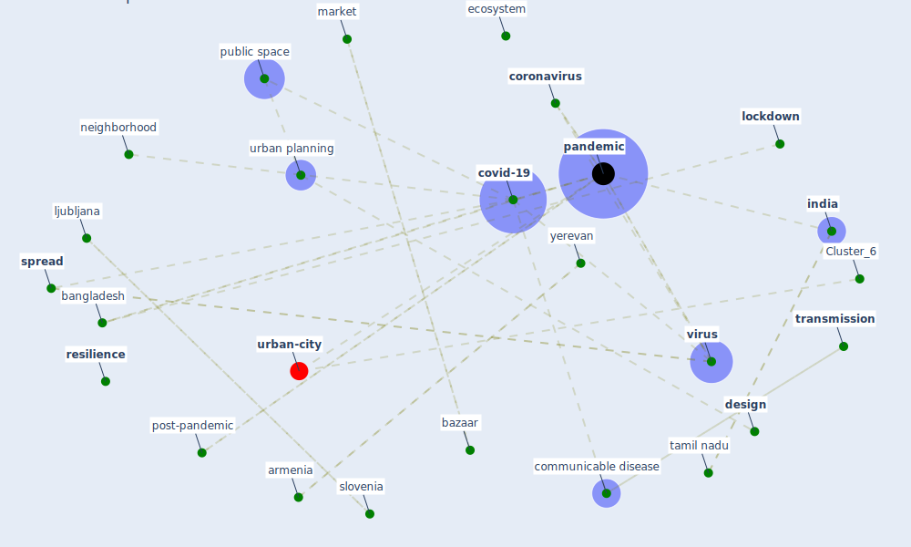

# Article: Impact of Covid-19 on the built environment (mahima_impact_2022)

* Source: [10.1108/FEBE-09-2021-0040](https://doi.org/10.1108/FEBE-09-2021-0040)
* Year: 2022
* Cluster: [urban-city](cluster_6)

## Keywords

 * activity, allam z, [architect](keyword_architect), architectural, armenia, bangladesh, bazaar, behavior, break the rule, [build environment](keyword_build_environment), chengalpattu, citizen, [city](keyword_city), communicable disease, [community](keyword_community), comorbiditie, [coronavirus](keyword_coronavirus), [country](keyword_country), [covid-19](keyword_covid-19), culture, [datum](keyword_datum), [design](keyword_design), designer, develop, dhaka, [ecosystem](keyword_ecosystem), edwar t hall, effect, emerald publishing limit, excel sheet, fall of economy, first circle, fixme, giovid 19, [health](keyword_health), hygiene, in person purchase, [india](keyword_india), [interaction](keyword_interaction), inventor, ipv6, ljubljana, [lockdown](keyword_lockdown), market, methodology, misuse the rule, movement of people, [neighborhood](keyword_neighborhood), observation, ongoing pandemic, online shopping, open space, [outbreak](keyword_outbreak), [pandemic](keyword_pandemic), paradigm shift, park, [pedestrian](keyword_pedestrian), [plan](keyword_plan), [policy](keyword_policy), policymaker, post-pandemic, practice, prevention in the future, private vehicle, [public health](keyword_public_health), public realm, [public space](keyword_public_space), public transportation, recession, research journal, [resilience](keyword_resilience), restriction impose on they, [russia](keyword_russia), [safety](keyword_safety), [sar cov 2](keyword_sar_cov_2), share one, singapore, [slovenia](keyword_slovenia), [social](keyword_social), [spread](keyword_spread), srm institute of science and technology, st petersburg, street, [sustainability](keyword_sustainability), tamil nadu, taylor and francis, taylor francis, [transmission](keyword_transmission), [unesco](keyword_unesco), [united kingdom](keyword_united_kingdom), university of oxford, urban design, urban planner, [urban planning](keyword_urban_planning), urban space, [virus](keyword_virus), walk, walkway, wholesale market, yerevan

## Concepts

 

## Neighbours

### Closest articles

* The Impact of COVID-19 on Public Space: A Review of the Emerging Questions - [LINK](article_honey-roses_impact_2020)
* Antivirus-built environment: Lessons learned from Covid-19 pandemic - [LINK](article_megahed_antivirus-built_2020)
* The Role of Architecture and Urbanism in Preventing Pandemics - [LINK](article_kumar_role_2021)
* COVID-19 Could Leverage a Sustainable Built Environment - [LINK](article_pinheiro_covid-19_2020)
* Coronavirus questions that will not go away: interrogating urban and socio-spatial implications of COVID-19 measures - [LINK](article_salama_coronavirus_2020)
* COVID-19 Pandemic: Rethinking Strategies for Resilient Urban Design, Perceptions, and Planning - [LINK](article_afrin_covid-19_2021)
* Houses amid COVID-19: Environmental challenges and design adaptation - [LINK](article_hizra_houses_2021)
* Respiratory pandemics, urban planning and design: A multidisciplinary rapid review of the literature - [LINK](article_harris_respiratory_2022)
* Learning from pandemics: Applying resilience thinking to identify priorities for planning urban settlements - [LINK](article_syal_learning_2021)
* How is COVID-19 Experience Transforming Sustainability Requirements of Residential Buildings? A Review - [LINK](article_tokazhanov_how_2020)

### Closest BPs

* Blueprint: Tracking and enforcing use of Personal Protective Equipment - [LINK](bp_23)
* Blueprint: Building Adaptation during a pandemic - [LINK](bp_14)
* Blueprint: Architecture design - [LINK](bp_2)
