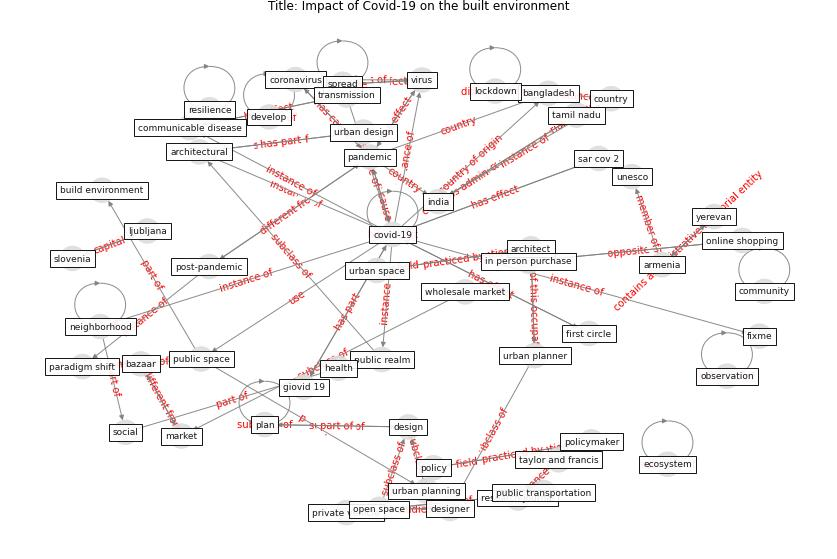

# Article: Impact of Covid-19 on the built environment (mahima_impact_2022)

* Source: [10.1108/FEBE-09-2021-0040](https://doi.org/10.1108/FEBE-09-2021-0040)
* Year: 2022
* Cluster: [building-space](cluster_1)

## Keywords

 * activity, allam z, [architect](keyword_architect), architectural, armenia, bangladesh, bazaar, behavior, break the rule, [build environment](keyword_build_environment), chengalpattu, [city](keyword_city), communicable disease, [community](keyword_community), [conflict of interest](keyword_conflict_of_interest), [coronavirus](keyword_coronavirus), [country](keyword_country), [covid-19](keyword_covid-19), culture, [datum](keyword_datum), [design](keyword_design), designer, develop, [ecosystem](keyword_ecosystem), edwar t hall, effect, emerald publishing limit, excel sheet, fall of economy, first circle, fixme, giovid 19, global pandemic, [health](keyword_health), hygiene, in person purchase, [india](keyword_india), [interaction](keyword_interaction), inventor, ipv6, ljubljana, [lockdown](keyword_lockdown), market, methodology, misuse the rule, movement of people, [neighborhood](keyword_neighborhood), observation, [online shopping](keyword_online_shopping), open space, [pandemic](keyword_pandemic), paradigm shift, park, pedestrian, [plan](keyword_plan), [policy](keyword_policy), policymaker, post-pandemic, private vehicle, [public health](keyword_public_health), public realm, [public space](keyword_public_space), public transportation, recession, research journal, [resilience](keyword_resilience), restriction impose on they, rural area, russia, [safety](keyword_safety), [sar cov 2](keyword_sar_cov_2), share one, [singapore](keyword_singapore), [slovenia](keyword_slovenia), [social](keyword_social), [social distancing](keyword_social_distancing), [social interaction](keyword_social_interaction), [spread](keyword_spread), srm institute of science and technology, st petersburg, stay away, street, [sustainability](keyword_sustainability), tamil nadu, taylor and francis, taylor francis, [transmission](keyword_transmission), [unesco](keyword_unesco), [united kingdom](keyword_united_kingdom), university of oxford, [urban area](keyword_urban_area), urban design, urban planner, [urban planning](keyword_urban_planning), urban space, [virus](keyword_virus), walk, walkway, wholesale market, yerevan

## Concepts

 

## Neighbours

### Closest articles

* The Impact of COVID-19 on Public Space: A Review of the Emerging Questions - [LINK](article_honey-roses_impact_2020)
* Antivirus-built environment: Lessons learned from Covid-19 pandemic - [LINK](article_megahed_antivirus-built_2020)
* The Role of Architecture and Urbanism in Preventing Pandemics - [LINK](article_kumar_role_2021)
* Designing for COVID-2x: Reflecting on Future-Proofing Human Habitation for the Inevitable Next Pandemic - [LINK](article_spennemann_designing_2022)
* COVID-19 Could Leverage a Sustainable Built Environment - [LINK](article_pinheiro_covid-19_2020)
* RESIDENTIAL ARCHITECTURE IN A POST-PANDEMIC WORLD: IMPLICATIONS OF COVID-19 FOR NEW CONSTRUCTION AND FOR ADAPTING HERITAGE BUILDINGS - [LINK](article_spennemann_residential_2021)
* Urban form: Realising the value of green space: a planners’ perspective on the COVID-19 pandemic - [LINK](article_ahmadpoor_urban_2021)
* Houses amid COVID-19: Environmental challenges and design adaptation - [LINK](article_hizra_houses_2021)
* Urban Green Infrastructure and Green Open Spaces: An Issue of Social Fairness in Times of COVID-19 Crisis - [LINK](article_reinwald_urban_2021)

### Closest BPs

* Blueprint: Architecture design - [LINK](bp_2)
* Blueprint: Building Adaptation during a pandemic - [LINK](bp_14)
* Blueprint: Tender support at building stage - [LINK](bp_9)
