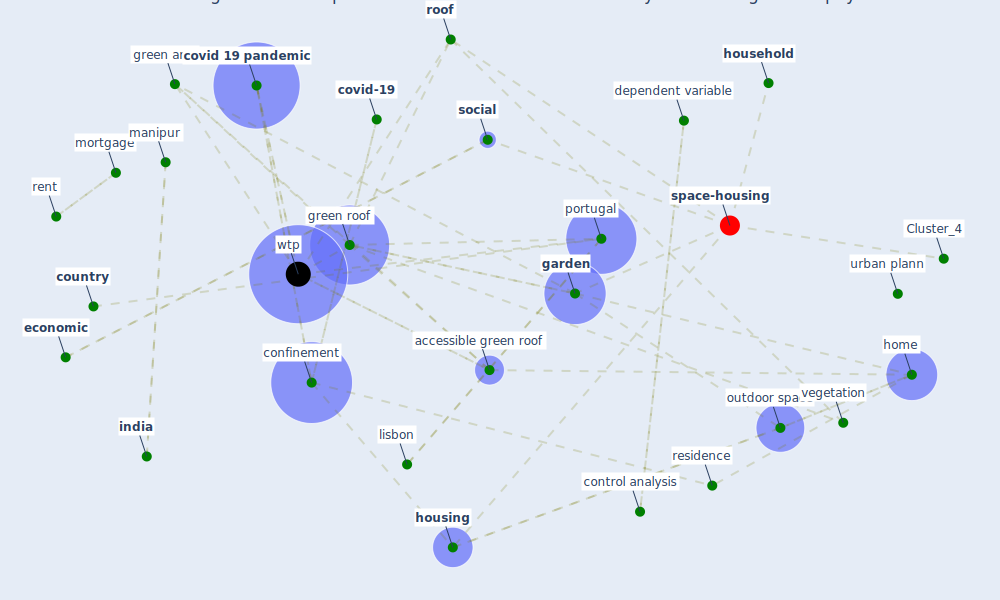

# Article: The role of green roofs in post COVID-19 confinement: An analysis of willingness to pay (manso_role_2021)

* Source: [10.1016/j.jobe.2021.103388](https://doi.org/10.1016/j.jobe.2021.103388)
* Year: 2021
* Cluster: [space-housing](cluster_4)

## Keywords

 * accessible, accessible green roof, aesthetic, after confinement, [analysis](keyword_analysis), [apartment](keyword_apartment), behaviour, [beijing](keyword_beijing), [biodiversity](keyword_biodiversity), [canada](keyword_canada), caribbean, categorical, childhood, childhood residence, [china](keyword_china), citizen, [city](keyword_city), [confinement](keyword_confinement), confinement condition, control analysis, copenhagen, correspond author, [cost](keyword_cost), [country](keyword_country), country of residence, [covid 19 pandemic](keyword_covid_19_pandemic), [covid-19](keyword_covid-19), current country of residence, degree, [denmark](keyword_denmark), dependent variable, descriptive statistic, [dwell](keyword_dwell), [economic](keyword_economic), [ecosystem](keyword_ecosystem), [europe](keyword_europe), eurostat, [garden](keyword_garden), gender, genderホ3, gr at home, green area, green infrastructure, [green roof](keyword_green_roof), [home](keyword_home), home environment, [hong kong](keyword_hong_kong), hongkong, [household](keyword_household), household income, [housing](keyword_housing), housing type, income, income relative contribution, [india](keyword_india), indifferent, inhabitant, large town, latin america, level of education, lisbon, logistic regression, m manso, m santamouris, maintenance, [manipur](keyword_manipur), [model](keyword_model), mortgage, multinomial, [new york city](keyword_new_york_city), [north america](keyword_north_america), outdoor, outdoor space, [pandemic](keyword_pandemic), perception, [portugal](keyword_portugal), property, publ, renew, rent, residence, [roof](keyword_roof), single house, [social](keyword_social), socio demographic, statistically significant, [sustainable development goal](keyword_sustainable_development_goal), totally agree, totally disagree, type of variable, uncontrolled analysis, university of lisbon, [urban](keyword_urban), urban for, urban plann, urban population, [variable](keyword_variable), vegetation, [wtp](keyword_wtp), ابعیm manso

## Concepts

 

## Neighbours

### Closest articles

* Association between indoor-outdoor green features and psychological health during the COVID-19 lockdown in Italy: A cross-sectional nationwide study - [LINK](article_spano_association_2021)
* Effects of the COVID-19 pandemic on the use and perceptions of urban green space: An international exploratory study - [LINK](article_ugolini_effects_2020)
* Green in times of COVID-19: urban green space relevance during the COVID-19 pandemic in Buenos Aires City - [LINK](article_marconi_green_2022)
* The impact of the COVID-19 pandemic on the importance of urban green spaces to the public - [LINK](article_noszczyk_impact_2022)
* Green infrastructure through the lens of “One Health”: A systematic review and integrative framework uncovering synergies and trade-offs between mental health and wildlife support in cities - [LINK](article_felappi_green_2020)
* Urban form: Realising the value of green space: a planners’ perspective on the COVID-19 pandemic - [LINK](article_ahmadpoor_urban_2021)
* Green spaces, especially forest, linked to lower SARS-CoV-2 infection rates: A one-year nationwide study - [LINK](article_jiang_green_2021)
* Urban Green Infrastructure and Green Open Spaces: An Issue of Social Fairness in Times of COVID-19 Crisis - [LINK](article_reinwald_urban_2021)
* The Impact of COVID-19 on Public Space: A Review of the Emerging Questions - [LINK](article_honey-roses_impact_2020)
* 10 Adaptive Measures for Public Places to face the COVID 19 Pandemic Outbreak - [LINK](article_cheshmehzangi_10_2020)

### Closest BPs

* Blueprint: Monitoring of wastewater - [LINK](bp_21)
* Blueprint: Resilience in staffing and skills training - [LINK](bp_12)
* Blueprint: Installing high-efficiency air filters - [LINK](bp_11)
