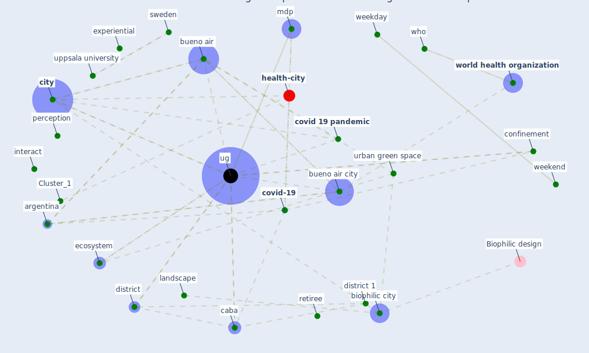

# Article: Green in times of COVID-19: urban green space relevance during the COVID-19 pandemic in Buenos Aires City (marconi_green_2022)

* Source: [10.1007/s11252-022-01204-z](https://doi.org/10.1007/s11252-022-01204-z)
* Year: 2022
* Cluster: [health-city](cluster_1)

## Keywords

 * alomo m, andrea vidmar, apathetic, [argentina](keyword_argentina), avellaneda, baseline, biophilic city, brooks sk, [bueno air](keyword_bueno_air), bueno air autonomous city, bueno air city, [building](keyword_building), caba, camarotti ac, [cdc](keyword_cdc), cepal, chacabuco, chain d, [city](keyword_city), compete interest, [confinement](keyword_confinement), [consent](keyword_consent), correspondence analysis, covid 19 confinement, [covid 19 pandemic](keyword_covid_19_pandemic), [covid-19](keyword_covid-19), day, [demographic](keyword_demographic), demographic status, dirksen j, district, district 1, district 12, district 6, district 7, domon g, dáil éireann, [ecosystem](keyword_ecosystem), ecosystemic service, education level, [employee](keyword_employee), estadísticasギba, [experience](keyword_experience), experiential, family, forest service, friend, gagliardi g, gcba, gender, giusti m, grassi b, [green](keyword_green), [health](keyword_health), hogare, [house](keyword_house), [infection](keyword_infection), innate connection withnature, interact, isolation, landscape, lustig, macassa g, mdp, ministerio de desarrollo urbano, modelo territorial, [occupant](keyword_occupant), [pandemic](keyword_pandemic), park, perception, [population](keyword_population), poverty, [quarantine](keyword_quarantine), resilient, retiree, [social](keyword_social), socio economic, subsecretaría deplaneamiento, [survey](keyword_survey), [sweden](keyword_sweden), [technology](keyword_technology), tommasi, [ug](keyword_ug), ugs, ugs density, uppsala university, urban ecosystem, [urban green space](keyword_urban_green_space), urban landscape, vouligny é, vulnerably, [water](keyword_water), webster rk, weekday, weekend, who, with family, with friend, [world health organization](keyword_world_health_organization), éireann

## Concepts

 

## Neighbours

### Closest articles

* Effects of the COVID-19 pandemic on the use and perceptions of urban green space: An international exploratory study - [LINK](article_ugolini_effects_2020)
* The role of green roofs in post COVID-19 confinement: An analysis of willingness to pay - [LINK](article_manso_role_2021)
* Green infrastructure through the lens of “One Health”: A systematic review and integrative framework uncovering synergies and trade-offs between mental health and wildlife support in cities - [LINK](article_felappi_green_2020)
* Green spaces, especially forest, linked to lower SARS-CoV-2 infection rates: A one-year nationwide study - [LINK](article_jiang_green_2021)
* Association between indoor-outdoor green features and psychological health during the COVID-19 lockdown in Italy: A cross-sectional nationwide study - [LINK](article_spano_association_2021)
* The impact of the COVID-19 pandemic on the importance of urban green spaces to the public - [LINK](article_noszczyk_impact_2022)
* Urban Green Infrastructure and Green Open Spaces: An Issue of Social Fairness in Times of COVID-19 Crisis - [LINK](article_reinwald_urban_2021)
* Urban form: Realising the value of green space: a planners’ perspective on the COVID-19 pandemic - [LINK](article_ahmadpoor_urban_2021)
* 10 Adaptive Measures for Public Places to face the COVID 19 Pandemic Outbreak - [LINK](article_cheshmehzangi_10_2020)

### Closest BPs

* Blueprint: Resilience in staffing and skills training - [LINK](bp_12)
* Blueprint: Monitoring of wastewater - [LINK](bp_21)
* Blueprint: Installing high-efficiency air filters - [LINK](bp_11)
