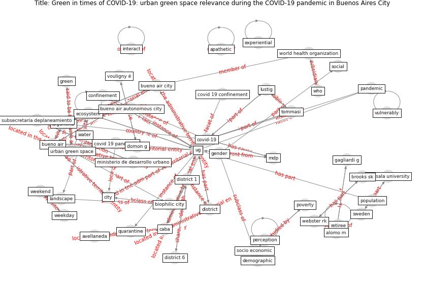

# Article: __Green in times of COVID-19: urban green space relevance during the COVID-19 pandemic in Buenos Aires City__ (marconi_green_2022)

* [10.1007/s11252-022-01204-z](https://doi.org/10.1007/s11252-022-01204-z)
* Cluster: [green-urban](cluster_15)

## Keywords

* [ug](keyword_ug), [caba](keyword_caba), [confinement](keyword_confinement), [covid-19](keyword_covid-19), [argentina](keyword_argentina), [urban ecosystem](keyword_urban_ecosystem), [urban green space](keyword_urban_green_space), [brooks sk](keyword_brooks_sk), [webster rk](keyword_webster_rk), bueno air, district 1, [pandemic](keyword_pandemic), green space, mdp, [park](keyword_park)

## Keywords at large

* [ug](keyword_ug), [confinement](keyword_confinement), [caba](keyword_caba), [covid-19](keyword_covid-19), [argentina](keyword_argentina), [urban green space](keyword_urban_green_space), [urban ecosystem](keyword_urban_ecosystem), [brooks sk](keyword_brooks_sk), [webster rk](keyword_webster_rk), [perception](keyword_perception)

## Concepts

 

### Closest articles 

* [Effects of the COVID-19 pandemic on the use and perceptions of urban green space: An international exploratory study](article_ugolini_effects_2020)
* [Urban Green Infrastructure and Green Open Spaces: An Issue of Social Fairness in Times of COVID-19 Crisis](article_reinwald_urban_2021)
* [Association between indoor-outdoor green features and psychological health during the COVID-19 lockdown in Italy: A cross-sectional nationwide study](article_spano_association_2021)
* [Home garden use during COVID-19: Associations with physical and mental wellbeing in older adults](article_corley_home_2021)
* [Blockchain technology and its applications to combat COVID-19 pandemic](article_sharma_blockchain_2022)
* [Refleksioner fra en pandemi](article_realdania_refleksioner_2022)
* [Pandemiens arkitektur](article_realdania_pandemiens_2022)
* [Mental health economics: A prospective study on psychological flourishing and associations with healthcare costs and sickness benefit transfers in Denmark](article_santini_mental_2021)
* [Psychological Effects of Home Confinement and Social Distancing Derived from COVID-19 in the General Population—A Systematic Review](article_rodriguez-fernandez_psychological_2021)
* [Treating two pandemics for the price of one: Chronic and infectious disease impacts of the built and natural environment](article_frank_treating_2021)

### References 

* [The psychological impact of COVID-19 on the mental
health in the general population](article_serafini_psychological_2020)
* [Effects of the COVID-19 pandemic on the use and
perceptions of urban green space: An international
exploratory study](article_ugolini_effects_2020)

### Cited by 

